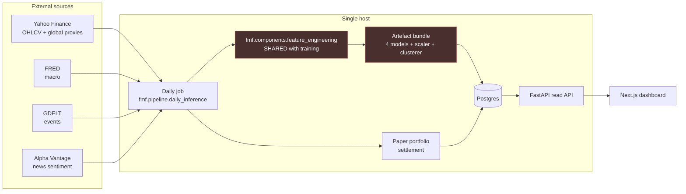

# 00 — Serving Layer: Overview

**Status:** design, not implemented. No code in this pass.
**Scope:** turn the trained artefacts in `ml_core/ml_pipeline/models/` into a daily prediction
service, a forward-tested accuracy record, a paper portfolio, a read API, and a dashboard.
**Audience:** whoever implements this next, and whoever reads the dissertation chapter that
cites the live accuracy numbers.

This file is standalone. Everything below is summarised here; the numbered files carry the
detail and the arguments.

---

## 1. What the system does

After the NSE close each trading day, one job fetches that day's bars and exogenous series,
rebuilds the 163-column feature panel, runs four models over ~96 tickers, and writes ~384
prediction rows to Postgres. The next day, the same job resolves yesterday's predictions
against the realised close and records whether each was right. A read API serves those rows;
a Next.js dashboard renders them; a paper portfolio trades the signal against real prices with
transaction costs applied.

One inference run per day. 96 rows in, 384 rows out. That number governs every
infrastructure decision in this document.

The two red boxes are where this design earns its keep. Everything else is a CRUD app.

---

## 2. The central risk

Features are computed today inside notebook 11, against a complete historical panel, in one
pass. At serving time they must be computed for one new day and produce the *same numbers*.
If they don't, the deployed model is not the evaluated model and every metric in the paper
stops describing the system that is running.

Verification against the notebooks turned up four concrete parity breaks, not one:

| # | Break | Severity |
|---|---|---|
| 1 | **The `StandardScaler` is never persisted.** Notebook 13 saves RF/XGB *before* fitting the scaler; notebook 14 refits its own; notebook 17 refits again from the full dataset at inference. There is no `scaler.pkl` in `models/`. | Blocker |
| 2 | **`volatility_cluster`, `vol_cluster_label`, `volatility_cluster_gmm`, `cluster_lag_1/2` come from a KMeans + GMM fitted on the whole panel in notebook 12 and never persisted.** These are model features. They cannot be reproduced for a single new day, and they were fitted across the train/test boundary. | Blocker + leakage |
| 3 | **`OBV` is a cumulative sum from the first bar of the series.** Its value at any date depends on the entire path from the panel epoch. A rolling-window recompute produces a different constant offset, in the 10⁶–10⁷ range, fed unscaled into RF and XGB. | Blocker |
| 4 | **RSI, ATR, EMA_20 and MACD are exponentially smoothed (IIR).** They converge but never become byte-identical from a truncated window. ~280 trading bars are needed for 1e-9 agreement. | Quantified, solvable |

Break 3 and 4 have the same fix and it is cheaper than the alternative: **recompute the full
per-ticker panel from a fixed epoch every day, rather than from a rolling window.** 96 tickers ×
~700 bars = 67,200 rows. Pandas does that in seconds. Exactness beats cleverness at this size.

Breaks 1 and 2 cannot be fixed by the serving layer alone. They mean **the four artefacts
currently in `models/` cannot be served with parity.** One retrain pass against the extracted
shared feature code is a prerequisite, not an optimisation. See `03-feature-parity.md` §7 for
the milestone.

---

## 3. Decisions, with the reason

| Decision | Reason |
|---|---|
| **Drop Express. Single FastAPI service.** | The deleted `server/` implemented auth, watchlist and a stock proxy — none of the five required read endpoints. Every endpoint here is a query over tables the Python job writes. A gateway adds a second deploy unit, a second pool, and a second schema mapping to save nothing. Detail and the counter-argument: `11-trade-offs.md` §2. |
| **No Kafka, no Redis, no queue.** | 96 rows/day is one message per 900 seconds. A day of predictions is ~40 KB; Postgres returns it from `shared_buffers` in under a millisecond. Cache invalidation for a table that changes once a day is pure liability. `11-trade-offs.md` §1. |
| **Postgres, single instance, no extensions beyond `pgcrypto`.** | ~96k prediction rows/year. Everything the dashboard needs is one indexed range scan. |
| **Full-history feature recompute from epoch `2023-01-02`, daily.** | Makes IIR-indicator and OBV parity exact rather than approximate. Costs ~67k rows of pandas work. `03-feature-parity.md` §3. |
| **`fmf/` becomes the shared code home.** | It is already packaged by `setup.py` and imported by `main.py`. Both the training re-run and the daily job import the *same* `fmf.components.feature_engineering`. One implementation, by construction. `01-repository-baseline.md` §4. |
| **Cron on the host, not Airflow.** | One job, one schedule, one dependency edge. `05-daily-batch-job.md` §2. |
| **`predictions` natural key `(trade_date, ticker, model_version)`.** | Makes the job idempotent under re-run, and makes a model swap unable to silently overwrite accuracy history. `04-data-model.md` §4. |

---

## 4. Honest statement of what is being served

From `models/dl_metrics_summary.json` and `models/baseline_metrics_summary.json`, on the
2025-01-01 → 2025-12-30 test split (23,808 rows):

| Model | Accuracy | ROC-AUC | F1 |
|---|---|---|---|
| RandomForest | 0.5052 | 0.5071 | 0.4653 |
| XGBoost | 0.4995 | 0.5058 | 0.4796 |
| LSTM | 0.5063 | 0.5121 | 0.4463 |
| Transformer | **0.5088** | **0.5123** | 0.5514 |

The test-set majority class is 50.24%. The best model beats it by **0.64 percentage points**.

This is not a reason to abandon the build — a forward-testing harness is exactly the right
instrument for a signal this thin, and building it is the contribution. It *is* a reason the
design does three specific things:

1. The dashboard shows accuracy with a **95% confidence interval**, never a bare percentage.
   At 96 predictions/day the standard error on one day's accuracy is 5.1pp — a daily number
   is noise rendered as a figure.
2. It records **how long until the edge is detectable**: distinguishing +0.64pp from zero at
   95% confidence needs ~23,400 predictions ≈ **244 trading days ≈ one full year of live
   running per model**. The dashboard states the current n against that target.
3. It separates forward-tested rows from backfilled ones at the schema level, in three tiers,
   because conflating them would turn a year of honest evidence into a restated backtest.
   `10-backfill-and-accuracy.md`.

---

## 5. File map

| File | Contents |
|---|---|
| `01-repository-baseline.md` | What is actually in the tree, verified. Corrections to the brief. What the repo state forces. |
| `02-architecture.md` | Components, processes, deployment topology, the Express decision. |
| `03-feature-parity.md` | **The hard part.** Skew analysis, shared-code extraction, warm-up maths, artefact versioning, the deploy-time parity assertion. |
| `04-data-model.md` | Postgres schema, concrete DDL-level detail, keys, indexes, retention. |
| `05-daily-batch-job.md` | Orchestration, ordering, failure modes and mitigations, idempotency. |
| `06-inference-service.md` | Artefact bundle, the two input contracts, model versioning, the ensemble. |
| `07-paper-portfolio.md` | Cost model with Indian equity charges, sizing, settlement, the signal/realised gap. |
| `08-read-api.md` | Endpoints, shapes, pagination, caching posture. |
| `09-dashboard.md` | Pages, what each shows, what it must not imply. |
| `10-backfill-and-accuracy.md` | Three-tier provenance, backfill procedure, statistics. |
| `11-trade-offs.md` | Kafka/Redis/queue rejected with numbers. Express. What changes at 10x. |
| `12-out-of-scope.md` | The boundary, on record. |

---

## 6. Build order

1. Extract `fmf.components.feature_engineering` from notebooks 03, 08, 11, 12. Assert it
   reproduces `final_model_dataset_with_volatility.parquet` exactly. (`03` §2)
2. Retrain the four models against it, persisting scaler and clusterer. (`03` §7)
3. Postgres schema + backfill of bars and exogenous series. (`04`, `10`)
4. Daily job, parity check wired into its startup. (`05`, `03` §6)
5. Read API. (`08`)
6. Paper portfolio settlement. (`07`)
7. Dashboard. (`09`)

Steps 1 and 2 are prerequisites. Step 3 can proceed in parallel with them.
