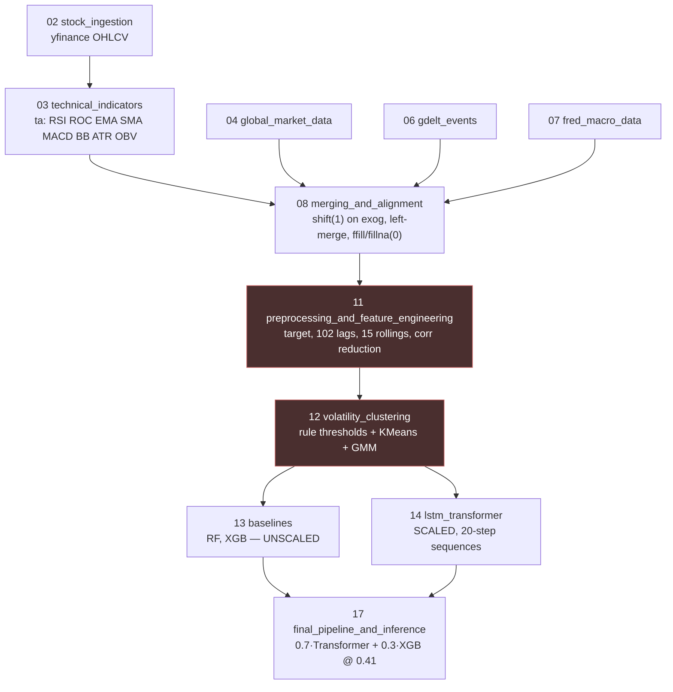

# 01 — Repository Baseline

What is actually in the tree as of branch `design` (working tree) and `HEAD` = `667ea18`.
Verified by reading the files, not by assumption. Design decisions downstream cite this file.

---

## 1. Corrections to the stated baseline

The brief that produced this document described the repo state. Four points are wrong, and
they change the design, so they are recorded here rather than quietly worked around.

### 1.1 `server/` is not empty, and it is not a bare `package.json`

`server/` is deleted in the branch-`design` working tree but present in `HEAD`. It contains a
complete TypeScript Express 5 application:

```
server/src/index.ts                    helmet, cors, express-rate-limit, WebSocketServer
server/src/controllers/{auth,stocks,watchlist}.controller.ts
server/src/routes/{auth,stocks,watchlist}.routes.ts
server/src/models/{user,stock,watchlist}.model.ts
server/src/middlewares/{auth,validate}.middleware.ts
server/src/database/db.ts
server/db/schema.sql                   users, stocks, watchlists + pg_trgm index
```

Dependencies: `express@^5.2.1`, `pg`, `redis`, `ws`, `jsonwebtoken`, `bcryptjs`, `zod`,
`yahoo-finance2`, `helmet`, `express-rate-limit`. `"main": "index.js"` is vestigial — the real
entry is `dist/index.js` via `npm start`, built from `src/index.ts`.

This matters because "drop Express" is now a decision to discard **working code**, not to
decline to write some. The justification has to be correspondingly stronger. See
`11-trade-offs.md` §2.

### 1.2 `client/` is not an unmodified Next.js starter

Also deleted in the working tree, present in `HEAD`. It contains project-specific pages and
state:

```
app/{page,layout}.tsx  app/dashboard/  app/portfolio/  app/orders/
app/stocks/[symbol]/   app/auth/{login,register}/  app/profile/
components/charts/{CandlestickChart,SparklineChart}.tsx
components/dashboard/{PortfolioSummary,WatchlistPanel,MarketIndices,GainersLosers,NewsSection}.tsx
components/stocks/{StockTable,StockCard,TradePanel,PriceDisplay,SearchBar}.tsx
components/ui/  (shadcn-style primitives)
store/{auth,stock,watchlist}-store.ts   (zustand)
hooks/{useWebSocket,useStockPrice,useDebounce}.ts
```

The page skeleton is close to what this design needs. `09-dashboard.md` recommends restoring
from `667ea18` rather than starting from `create-next-app`.

### 1.3 Not every file in `fmf/` is 0 bytes

11 of 13 `.py` files are empty. Two are not:

- `fmf/exception/exception.py` (561 B) — a working `FMFException` that captures filename and
  line number from `sys.exc_info()`.
- `fmf/logging/logger.py` (428 B) — configures `logging.basicConfig` to a timestamped file
  under `./logs`.

### 1.4 `main.py` crashes on purpose, not from a broken import

```python
from fmf.exception.exception import FMFException   # resolves — the file has content
from fmf.logging.logger import logging             # resolves
...
    a = 1/0                                        # deliberate
    raise FMFException(e, sys)
```

It is a smoke test for the exception/logging wiring and it works. The package skeleton is not
broken; it is unpopulated. That is a meaningfully better starting point.

### 1.5 `requirements.txt` has 37 packages, not 47, and is not at the repo root

It is at `ml_core/ml_pipeline/requirements.txt`. None are pinned. Consequences in §5.

---

## 2. The pipeline, as executed

31 notebooks under `ml_core/ml_pipeline/notebooks/`. The chain that produces what gets served:



Notebooks 15, 16, 18 produce `calibrated_model.pkl`, `optimized_threshold.json`,
`ensemble_config.json`, `improved_metrics.json`. Notebooks 19–31 are backtesting, portfolio
and alpha work — out of scope for this phase (`12-out-of-scope.md`).

### 2.1 Verified shapes and dates

| Quantity | Value | Source |
|---|---|---|
| Merged panel | 65,895 × 41 | nb11 out |
| Tickers requested | 100 (Nifty 100) | `CLAUDE.md` |
| Tickers surviving `MIN_HISTORY_DAYS = 250` | **96** | nb11 out |
| Dropped | TMPV (3 bars), TATACAP (5), ENRIN (83), HYUNDAI (247) | nb11 out |
| Panel date range | 2023-03-15 → 2025-12-31 | nb11 out |
| After feature engineering | 63,541 × 156 | nb11 out |
| After regime features (nb12) | 63,541 × 168 | nb13 out |
| **Model features** | **163** (168 − Date, Ticker, target, `volatility_regime_label`, `vol_cluster_regime_name`) | nb13 out |
| Train | 39,733 rows, 2023-04-18 → 2024-12-31 | nb13 out |
| Test | 23,808 rows, 2025-01-01 → 2025-12-30 | nb13 out |
| Sequences (window 20) | train (37813, 20, 163), test (21888, 20, 163) | nb14 asserts |
| Target balance, train / test | 52.4% / 49.76% up | nb13 out |

### 2.2 Feature composition of the 163

| Group | Count | Notes |
|---|---|---|
| Price / volume | 5 | Open High Low Close Volume — **raw, unscaled, in the model input** |
| Return | 1 | `Log_Return` dropped by correlation reduction |
| Technical | 13 | RSI(14) ROC(10) EMA_20 SMA_20 MACD(12,26,9) MACD_Signal BB_upper BB_lower ATR(14) Volatility_20 Volatility_50 Volume_MA_20 OBV |
| Global proxies | 6 | `NASDAQ_RET` dropped (corr ≥ 0.95 with `SP500_RET`) |
| Index | 1 | `NIFTY_RET` |
| GDELT | 7 | `Event_Count` `Avg_Tone` + 5 theme flags |
| Macro | 3 | `GDP` dropped (macro multicollinearity) |
| **Lags (1,2,3)** | **102** | applied to returns + technical + global + gdelt + macro |
| **Rollings (5,10,20)** | **15** | `return_roll_{mean,std}`, `momentum_`, `volume_roll_{mean,std}`, all `shift(1)` |
| Regime (nb12) | 10 | `volatility_regime` `volatility_cluster` `vol_cluster_label` `volatility_cluster_gmm` `regime_change` `regime_persistence` `regime_lag_1/2` `cluster_lag_1/2` |

### 2.3 Exogenous alignment, exactly as trained

Notebook 08, cells 12–14 and 26–28:

```
exog[cols] = exog[cols].shift(1)          # shift on the exog series' OWN row index
merged = stock.merge(exog, on='Date', how='left')
global_cols  -> ffill()
macro_cols   -> ffill()
gdelt_flags  -> fillna(0).astype(int)
Event_Count, Avg_Tone -> fillna(0)
```

Two things to note, both of which the live path must reproduce and neither of which is
obvious: the shift is **positional on the exogenous calendar**, not a calendar-day offset; and
GDELT missingness means **zero**, while global and macro missingness means **carry forward**.
Getting this backwards on a live day is a silent skew. `03-feature-parity.md` §5.

---

## 3. Trained artefacts, as they exist

`ml_core/ml_pipeline/models/`:

| File | Size | Produced by | Servable? |
|---|---|---|---|
| `rf_baseline.pkl` | 6.1 MB | nb13 | Yes, but see §3.1 |
| `xgb_baseline.pkl` | 1.2 MB | nb13 | Yes, but see §3.1 |
| `lstm_model.pt` | 372 KB | nb14, `state_dict` only | Needs class + scaler |
| `transformer_model.pt` | 458 KB | nb14, `state_dict` only | Needs class + scaler |
| `calibrated_model.pkl` | 769 B | nb16 | Wrapper; not in the serving path |
| `baseline_metrics_summary.json` | 615 B | nb13 | Reference |
| `dl_metrics_summary.json` | 3.2 KB | nb14 | Reference |
| `optimized_threshold.json` | 153 B | nb16 | `{"optimal_threshold": 0.41}` |
| `ensemble_config.json` | 77 B | nb16 | `{transformer: 0.7, xgb: 0.3, threshold: 0.41}` |
| `baseline_feature_importance.csv` | 15 KB | nb13 | Reference |
| **`scaler.pkl`** | — | **absent** | **Blocker** |
| **regime clusterer** | — | **absent** | **Blocker** |

`models/multi_horizon_regime/` (from notebook 22) does the right thing and is worth copying:
`best_high_transformer_t1.pt` ships alongside `best_high_transformer_t1_scaler.pkl` and
`best_high_transformer_t1_meta.json`. The precedent for artefact bundling already exists in
this repo — it just was not applied to the four primary models.

### 3.1 Two different input contracts

- **RF and XGB** were fit on `X_train` **raw**. `Close` at ~3200, `OBV` at ~5×10⁶,
  `Volume_MA_20` at ~3.5×10⁵ go into the trees unscaled.
- **LSTM and Transformer** were fit on `StandardScaler`-transformed features, reshaped into
  `(n, 20, 163)` per-ticker sequences.

The serving layer must maintain both. Detail in `06-inference-service.md` §2.

### 3.2 `.pt` files are `state_dict`s

`torch.save(lstm_model.state_dict(), ...)`. Loading requires the exact `LSTMClassifier` /
`TransformerClassifier` definitions (hidden 64, 2 layers, dropout 0.2; d_model 64, 4 heads,
2 layers, learned positional encoding, `max_len=20`, GELU, `dim_feedforward=256`). These
classes are currently duplicated verbatim in notebooks 14 and 17. They move to
`fmf/components/model_arch.py`, once.

---

## 4. `fmf/` is the intended home, and this design commits to it

`setup.py` already declares `name="financial-marketing-forecasting"`, `find_packages()`,
`python_requires=">=3.11"`, and reads `requirements.txt`. The `-e .` line is commented out
with a note to enable it when the project is complete. **Enable it now** — the whole point of
the parity design is that training and serving import the same module, and that requires the
package to be installed, not sys.path-hacked.

Target layout. Files marked ● exist with content; ○ exist and are empty; ✚ are new.

```
fmf/
├── constant/__init__.py            ○ → ✚  EPOCH_DATE, TICKERS, LAG_STEPS, ROLL_WINDOWS,
│                                          SEQUENCE_WINDOW, CORR_THRESHOLD, FEATURE_ORDER,
│                                          MIN_HISTORY_DAYS, regime thresholds
├── entity/config_entity.py         ○ → ✚  frozen dataclasses for every config above
├── components/
│   ├── data_ingestion.py           ○ → ✚  yfinance / FRED / GDELT / Alpha Vantage fetchers
│   ├── data_validation.py          ✚      notebook 09 checks, as assertions
│   ├── feature_engineering.py      ✚      ★ notebooks 03 + 08 + 11 + 12 — THE shared module
│   ├── model_arch.py               ✚      LSTMClassifier, TransformerClassifier
│   ├── model_trainer.py            ✚      notebooks 13 + 14
│   └── model_inference.py          ✚      notebook 17
├── pipeline/
│   ├── training_pipeline.py        ○ → ✚
│   ├── daily_inference_pipeline.py ✚
│   └── backfill_pipeline.py        ✚
├── portfolio/                      ✚      cost model, sizing, settlement
├── api/                            ✚      FastAPI app, routers, Pydantic schemas
├── store/                          ✚      SQLAlchemy Core / psycopg repositories
├── utils/__init__.py               ○ → ✚  artefact loading, sha256, run-id minting
├── exception/exception.py          ●      keep as-is
└── logging/logger.py               ●      keep; add a JSON handler for the daily job
```

The ★ module is the entire parity argument. `03-feature-parity.md` §2 specifies its interface.

---

## 5. What the unpinned requirements force

37 unpinned lines. For a notebook project that is untidy. For a serving layer it is a
correctness problem, because two of the artefact formats are version-sensitive:

- **`rf_baseline.pkl` and `xgb_baseline.pkl` are pickles.** Unpickling a scikit-learn estimator
  under a different minor version raises `InconsistentVersionWarning` and is not guaranteed to
  behave identically. A warning is not a failure — the service would serve subtly wrong
  numbers and log nothing that looks alarming.
- **`torch.load` on a `state_dict`** is more forgiving, but `nn.TransformerEncoderLayer`
  internals have changed across releases.

**The versions used at training are not recorded anywhere.** Nothing in the repo says which
scikit-learn produced those pickles.

Required, and cheap:

1. Split into `requirements/base.txt`, `requirements/train.txt`, `requirements/serve.txt`.
   The serving image does not need `tensorflow` (listed but unused — only `torch` appears in
   the notebooks), `streamlit`, `flask`, `mlflow`, `evidently`, `matplotlib`, `seaborn`,
   `plotly`, `mplfinance`, `ipykernel`. That is 10 of 37 lines removed from the serving
   surface.
2. Pin everything with `==`. Generate `requirements/serve.lock.txt` with hashes.
3. At retrain time, write the resolved runtime into `model_versions.runtime` (jsonb):
   `{python, numpy, scipy, scikit-learn, xgboost, torch, pandas}`. The artefact loader
   compares at startup and **refuses to load on mismatch** rather than warning.

Point 3 is what makes the pinning enforceable instead of aspirational. `06-inference-service.md` §4.

---

## 6. Secrets and configuration

`.env` is correctly gitignored (`ml_core/ml_pipeline/.gitignore`: `venv`, `.env`, processed
CSV/parquet). Keys are read via `load_dotenv()` + `os.getenv()` — `ALPHA_VANTAGE_API_KEY`,
`FRED_API_KEY`. That pattern carries over unchanged; the daily job reads the same names.

Add for the serving layer: `DATABASE_URL`, `FMF_MODEL_DIR`, `FMF_ACTIVE_MODEL_VERSIONS`,
`FMF_RUN_TZ` (`Asia/Kolkata`). No secret ever enters Postgres or a log line.

Note that `Market_Data/processed/*.parquet` is gitignored, so **the training panel is not in
the repository**. The parity check in `03-feature-parity.md` §6 needs it. Either the panel is
regenerated by re-running notebooks 02–12, or a fixture of ~200 sampled rows is committed
under `tests/fixtures/parity_panel.parquet` (~300 KB). Recommend the fixture: the check must
run on every deploy, including on a machine that has never run the notebooks.

---

## 7. Constraints this baseline imposes on everything downstream

| Constraint | Where it bites |
|---|---|
| 96 tickers, not 100 | Every count in this design. Universe changes need a `tickers` table, not a constant. |
| Panel starts 2023-01-02; models trained through 2024-12-31 | Backfill has three provenance tiers, not two. `10-backfill-and-accuracy.md`. |
| Scaler and clusterer absent | Retrain is a prerequisite. `03-feature-parity.md` §7. |
| OBV is path-dependent from the epoch | Full-history recompute, not rolling window. `03-feature-parity.md` §3. |
| Two input contracts (scaled / unscaled) | The artefact bundle carries a per-family contract flag. `06-inference-service.md` §2. |
| Training runtime versions unrecorded | Recorded at retrain; loader enforces. §5 above. |
| `server/` and `client/` exist in `667ea18` | Restoring is cheaper than rewriting for the client; not for the server. `11-trade-offs.md` §2. |
