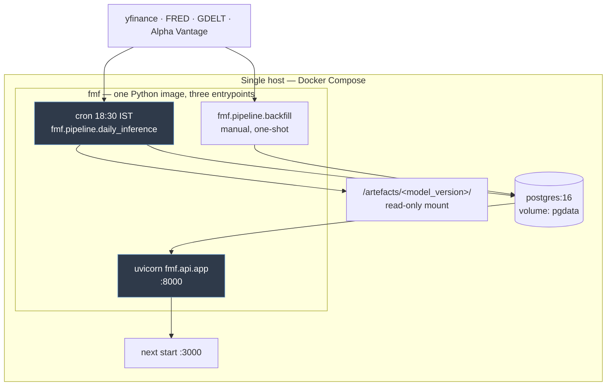
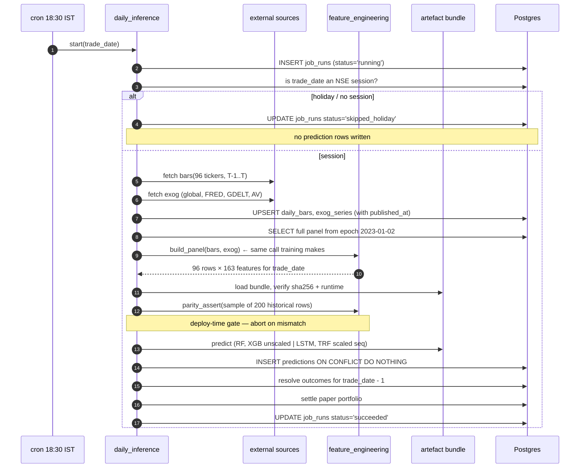

# 02 — Architecture

---

## 1. Sizing first

Every structural decision below follows from these numbers, so they come first.

| Quantity | Value |
|---|---|
| Tickers | 96 |
| Inference runs per day | 1 |
| Feature rows produced per day | 96 |
| Models scored | 4 + 1 ensemble |
| Prediction rows written per day | 480 |
| Prediction rows per year (250 sessions) | 120,000 |
| Feature panel recomputed daily | 96 × ~700 bars ≈ 67,200 rows × 163 cols |
| Peak working set (float64) | 67,200 × 163 × 8 B ≈ **88 MB** |
| Sequence tensor for DL inference | 96 × 20 × 163 × 4 B ≈ **1.3 MB** |
| Wire size of one day's predictions (JSON) | ~50 KB |
| Expected API load | single-digit req/s, human-driven |

A whole year of predictions is 120k rows. That fits in a laptop's page cache. There is no
scale problem here and the design must not invent one.

---

## 2. Components

Four processes. Two of them are the same image with a different entrypoint.

### 2.1 `fmf.pipeline.daily_inference` — the batch job

Runs once per trading day at 18:30 IST (NSE closes 15:30; the three-hour gap absorbs Yahoo's
consolidation lag). Fetch → validate → recompute panel → parity-assert → infer → persist →
settle yesterday → settle portfolio. Full specification and failure modes in
`05-daily-batch-job.md`.

Not a service. It starts, does ~90 seconds of work, writes, and exits. It holds no state
between runs; everything it needs is in Postgres or on the artefact mount.

### 2.2 `fmf.api.app` — the read API

FastAPI + uvicorn, one worker. Read-only against Postgres except for two portfolio mutation
endpoints (`08-read-api.md` §4). No business logic beyond serialisation and one accuracy
aggregation. It never computes a feature and never loads a model — if the API can produce a
prediction, there are two inference code paths and the parity guarantee is void.

### 2.3 Postgres 16

Single instance, one database, one schema. `pgcrypto` for `gen_random_uuid()`; nothing else.
Schema in `04-data-model.md`.

### 2.4 Next.js dashboard

Server components fetching the API directly. No client-side polling — the data changes once a
day. `09-dashboard.md`.

### 2.5 The artefact mount

`/artefacts/<model_version>/` — read-only into the job container, containing the model file,
its scaler, its clusterer, and `meta.json`. Immutable by convention: a new training run gets a
new directory, never an overwrite. `06-inference-service.md` §3.

---

## 3. Node/Express: dropped

**Decision: remove `server/`. The FastAPI service is the only backend.**

This discards working TypeScript that exists in `667ea18` (`01-repository-baseline.md` §1.1),
so the argument has to be more than "Python is already here".

**What `server/` actually implements:** JWT register/login, a watchlist CRUD, a stock search
and quote proxy over `yahoo-finance2`, and a WebSocket price broadcaster. Backed by a schema
of `users`, `stocks`, `watchlists`.

**What this system needs:** today's predictions, per-ticker prediction history, model
comparison, live accuracy, portfolio state.

The overlap is zero. Not "small" — zero. Every endpoint in `server/` serves a feature that
`12-out-of-scope.md` places outside this phase (multi-user auth, watchlists) or that the
prediction pipeline supersedes (live quote proxy, WebSocket price push — the horizon is one
trading day; a socket that pushes an update every 24 hours is a cron job with extra steps).

**If Express were kept as a gateway**, the concrete costs:

| Cost | Detail |
|---|---|
| Second schema mapping | Every prediction, portfolio and accuracy shape defined twice: Pydantic and TypeScript. They drift. |
| Second connection pool | Two pools against one Postgres, two sets of timeout semantics. |
| Second deploy unit | Node runtime, `npm ci`, `tsc` build, in an otherwise single-language deployment. |
| Extra hop | +2–4 ms on a request path serving single-digit req/s. Irrelevant to users, but it buys nothing. |
| Ambiguous ownership | "Which service validates the ticker symbol?" has to be answered once per endpoint, forever. |

**What is genuinely lost by dropping it**, stated plainly:

- The JWT + bcrypt auth middleware. Out of scope this phase (single account). If multi-user
  arrives, FastAPI's `OAuth2PasswordBearer` + `passlib` is a comparable amount of code.
- `yahoo-finance2`, which is a better-maintained client than `yfinance`. But the daily job
  needs *historical* bars, which `yfinance` already supplies in the notebooks and which the
  training panel was built with. Switching the fetch client would itself be a parity risk
  (`03-feature-parity.md` §5.4) — so keeping `yfinance` is actively correct, not a compromise.
- The WebSocket server. Not needed at a daily cadence.

**The counter-argument, honestly:** if this project later wants real-time quotes on the ticker
detail page, `server/` is the natural home and it already works. That is a real future cost.
It is bounded, because the code is preserved in git at `667ea18` and can be restored with one
`git checkout`. Paying a permanent two-language tax now to avoid a possible one-command
restoration later is the wrong trade.

**Recorded as a decision, with the condition that would reverse it:** if intraday or
sub-minute price streaming enters scope, restore `server/` as a dedicated market-data gateway
and leave the prediction API in FastAPI. Do not merge the two.

---

## 4. Why Python owns the API too

The alternative to "one FastAPI service" is not only Express — it is also "Python inference
job + thin API in anything". Python wins on one specific ground: `fmf.constant.FEATURE_ORDER`,
the model version registry, and the prediction row schema are all defined once, in the package
that produced the rows. An API in another language re-declares them. Given that the entire
design is organised around *one* implementation of a shared contract, adding a second language
that must mirror that contract by hand contradicts the premise.

`fastapi` and `uvicorn` are already in `requirements.txt`. So are `flask` and `streamlit`; all
three should not survive. Keep FastAPI (typed request/response models, OpenAPI for the
dashboard's client types), drop `flask` and `streamlit` from the serving requirements.

---

## 5. Process boundaries and data flow

The parity assertion sits **inside** the job, before inference, not in CI only. A model file
swapped on the artefact mount between deploys would otherwise be served unchecked.

---

## 6. Deployment

`docker compose` on one host. Four services:

| Service | Image | Notes |
|---|---|---|
| `postgres` | `postgres:16-alpine` | named volume `pgdata`, `pg_dump` to a local file nightly |
| `api` | `fmf:<sha>` | `uvicorn fmf.api.app:app --workers 1`, healthcheck `/healthz` |
| `job` | `fmf:<sha>` | `restart: "no"`, launched by host cron via `docker compose run --rm job` |
| `web` | `web:<sha>` | `next start` |

Host cron rather than a scheduler container: one entry, visible in `crontab -l`, no supervisor
process to keep alive. Trade-off argued in `05-daily-batch-job.md` §2.

Single machine. What changes at 10x is in `11-trade-offs.md` §3 — the short version is that
the database and the models are nowhere near the limit, and the first thing to break is the
external fetch.

---

## 7. Observability

No Prometheus, no Grafana, no tracing. At one run per day, the operational question is "did
last night's job work, and were its inputs stale?", and that is a table:

- **`job_runs`** — one row per attempt: `run_id`, `trade_date`, `status`, timings,
  `rows_written`, `error`. This *is* the monitoring.
- **`parity_runs`** — one row per parity assertion: max absolute deviation per column, pass/fail.
- **Structured logs** — JSON lines to stdout, captured by the Docker driver, keyed by `run_id`.
- **One alert** — if no `job_runs` row with `status='succeeded'` exists for the most recent NSE
  session by 20:00 IST, send an email. A cron entry and `psql`, not an alerting stack.
- **`/healthz`** returns DB reachability, active model versions, the date of the most recent
  successful run, and exogenous staleness in days. That last field is what makes a silently
  degraded input visible.
