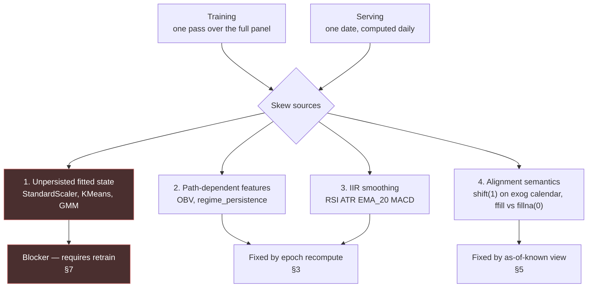

# 03 — Train/Serve Parity

The central risk. This file specifies how a feature value computed for a single new trading day
is made identical to the value training would have produced for that same day.

**The claim being defended:** for every `(trade_date, ticker)` and every one of the 163
features, the value the serving path computes equals the value the training path computed, to
within float64 representation error. If that claim fails, the numbers in `dl_metrics_summary.json`
describe a different system than the one running, and the dissertation's evaluation section is
about a model that was never deployed.

---

## 1. Where the skew comes from

Notebook 11 computes features **once, over a complete panel of 65,895 rows, in a single pandas
pass**, with `groupby('Ticker')` and vectorised `.shift()` / `.rolling()`. Serving needs one
row per ticker for one date. Four distinct mechanisms make these disagree.



Sources 2, 3 and 4 are fixable inside the serving layer. Source 1 is not — it requires one
retrain pass (§7).

---

## 2. One implementation: `fmf.components.feature_engineering`

### 2.1 The rule

There is exactly one function that turns bars and exogenous series into model features. Both
the training pipeline and the daily job call it. Neither has a private copy of any step.

Today the logic is spread across four notebooks, with `select_features` and the model classes
**duplicated verbatim between notebooks 14 and 17**. That duplication is the skew mechanism in
miniature: two copies of one contract, already diverging (notebook 17 refits the scaler where
notebook 14 kept it in memory).

### 2.2 Interface

```
fmf.components.feature_engineering

build_panel(
    bars:      DataFrame[Date, Ticker, Open, High, Low, Close, Volume],
    exog:      ExogPanel,                # global, gdelt, macro — see §5
    fitted:    FittedState,              # scaler + regime clusterer, loaded not fitted
    *,
    config:    FeatureConfig,            # frozen dataclass from fmf.entity
    as_of:     date | None = None,       # None = whole panel (training)
) -> FeaturePanel                        # Date, Ticker, target?, 163 feature columns
```

Design points that carry the guarantee:

- **`as_of` changes only what is returned, never what is computed.** With `as_of` set, the
  function computes the complete panel from the epoch and then slices the final date. It does
  **not** take a shortcut. This is the single most important line in this document: a "fast
  path for one day" is exactly how skew gets reintroduced six months from now, by someone
  optimising in good faith. §3 shows the shortcut saves nothing anyway.
- **`fitted` is an input, never fitted inside.** `build_panel` cannot construct a
  `StandardScaler` or a `KMeans`. It has no `.fit()` anywhere in its call graph. Training
  fits them in `fmf.components.model_trainer` and hands them in; serving loads them from the
  artefact bundle and hands them in. The type system enforces it — `FittedState` has no
  public constructor from raw data, only `FittedState.load(path)` and
  `FittedState.fit(train_slice)`, and the latter lives in the trainer module.
- **Column order is a constant, not an emergent property.** Today the 163 columns are whatever
  `[c for c in data.columns if c not in drop_cols]` yields — a function of pandas insertion
  order across four notebooks. RF and XGB consume positional arrays; a reordering silently
  permutes the inputs and the model still returns confident probabilities.
  `fmf.constant.FEATURE_ORDER` becomes an explicit 163-element tuple, and `build_panel`'s last
  act is `return panel[list(ID_COLS) + list(FEATURE_ORDER)]` with an assertion on length and
  set-equality. The tuple is generated once from the existing panel and committed.
- **Sub-steps are separately callable and separately testable**, but only composed in one
  place: `add_technical_indicators` (nb03) → `align_exogenous` (nb08) → `add_target` /
  `add_lags` / `add_rollings` / `reduce_features` (nb11) → `add_regime_features` (nb12).

### 2.3 Extraction acceptance test

The extraction is done when this passes, and not before:

```
regenerate = build_panel(bars_from_db, exog_from_db, fitted=FittedState.load(v1),
                         config=TRAINING_CONFIG, as_of=None)
reference  = read_parquet('Market_Data/processed/final_model_dataset_with_volatility.parquet')

assert_frame_equal(regenerate[ID + FEATURE_ORDER],
                   reference[ID + FEATURE_ORDER],
                   check_exact=False, rtol=0, atol=1e-12)
```

Shape must be `(63541, 168)`, tickers 96, dates 2023-04-18 → 2025-12-30. Any column that
cannot pass this is either fixed or removed from `FEATURE_ORDER` — it must not be served on
the assumption that "close enough" is fine, because §7 shows two columns currently cannot pass
it at all.

---

## 3. How much history the job needs

The brief assumed "the longest lookback is ~60 days plus a 20-day sequence window", and that a
rolling window of that size would do. **That is wrong by roughly an order of magnitude**, and
the error is not conservative — it produces plausible-looking numbers rather than a crash.

### 3.1 Finite-window features

| Feature | Bars required |
|---|---|
| `ROC(10)` | 11 |
| `SMA_20`, `BB_upper/lower`, `Volume_MA_20` | 20 |
| `momentum_20`, `return_roll_{mean,std}_20` (`shift(1)` + 20) | 21 |
| `Volatility_50` | 51 |
| `Volatility_50_lag_3` | 54 |

Maximum: **54 bars.** This is the "~60 days" figure, and it is correct — for this subset only.

### 3.2 Infinite-impulse-response features

`ta` implements RSI and ATR with Wilder smoothing (α = 1/window) and EMA/MACD with
`ewm(span, adjust=False)`. Both are recursive: the value at bar *n* depends on the seed value
with weight `(1−α)ⁿ`. It never reaches zero.

For a truncated window to agree with a full-history computation, `(1−α)ⁿ` must fall below the
tolerance:

| Feature | α | decay | bars for 1e-9 | bars for 1e-16 (float64) |
|---|---|---|---|---|
| `RSI(14)`, `ATR(14)` — Wilder | 1/14 | 0.92857 | 280 | **498** |
| `MACD` slow EMA(26) | 2/27 | 0.92593 | 270 | 479 |
| `MACD_Signal` (EMA 9 of MACD) | 0.2 | 0.8 | 363 (compounded) | ~570 |
| `EMA_20` | 2/21 | 0.90476 | 208 | 369 |

**~570 bars for true float64 identity.** A 60-bar window leaves RSI carrying `0.928⁶⁰ ≈ 1.1%`
of an arbitrary seed. On an RSI in the 40–60 range that is a deviation of ~0.5 points — small,
persistent, one-directional, and entirely invisible unless you look for it.

### 3.3 Unbounded-lookback features

Three features have no finite warm-up at any tolerance:

- **`OBV`** — `OnBalanceVolumeIndicator` is a cumulative sum of ±volume from the first bar of
  the series. It is a running total with no decay. A window starting at bar *k* produces
  `OBV_true − OBV_at_k`, an arbitrary constant offset in the **10⁶–10⁷ range**.
  `OBV` enters RF and XGB **unscaled** (`01-repository-baseline.md` §3.1). Tree splits learned
  at `OBV ≈ 5.4e6` do not fire the same way on `OBV ≈ 2e5`. This alone would make the served
  RF a different function of the input than the evaluated RF.
- **`regime_persistence`** — a `cumcount` within a regime block, where blocks are delimited by
  `regime_change`. A window that starts mid-block restarts the count at 1.
- **`cluster_lag_1/2`** — see §7; unbounded for a different reason.

### 3.4 Decision: recompute the full panel from a fixed epoch, every day

Warm-up is the wrong frame. The right question is what a full recompute costs.

| | Value |
|---|---|
| Epoch | `2023-01-02`, pinned in `fmf.constant.EPOCH_DATE` |
| Bars per ticker at 2026-01 | ~740 |
| Total panel rows | 96 × 740 ≈ **71,000** |
| Memory, float64, 163 cols | ~93 MB |
| Measured cost of the equivalent notebook-11 pass | seconds |

Against §3.2, a "correct" rolling window would need ~570 bars per ticker — **77% of the full
history**. The optimisation saves 23% of a job that runs for under two minutes, once a day,
and in exchange it reintroduces every skew mechanism in §3.2 and §3.3.

So: **the daily job pulls every bar from `EPOCH_DATE` to `trade_date` out of Postgres and
recomputes the entire panel.** Then it slices the last date. Parity becomes exact rather than
asymptotic, `OBV` and `regime_persistence` become correct by construction, and the warm-up
question stops existing.

`11-trade-offs.md` §3 shows this holds well past 10x: 1,000 tickers × 10 years is ~2.5M rows,
which is still a single-machine pandas job.

**Consequence for data completeness:** `daily_bars` must be gap-free from the epoch. A missing
bar shifts every downstream rolling and recursive value for that ticker. The job asserts, per
ticker, that the bar count matches the NSE session count between `EPOCH_DATE` and
`trade_date`, and refuses to predict for any ticker that fails. See `05-daily-batch-job.md` §4.

---

## 4. Fitted state: persistence, versioning, loading

### 4.1 What is currently persisted: nothing

Verified in the notebooks:

| Notebook | Fitted object | Fate |
|---|---|---|
| 13, cell 24 | `StandardScaler` on `X_train` | fit **after** cell 22 saved the models. Never written to disk. |
| 14, cell 6 | `StandardScaler` on `X_train` | refit from scratch. Cell 22 saves `.pt` files only. |
| **17, cell 7** | `StandardScaler` on `X_train` | **refit again, at "inference" time**, from the full dataset parquet. |
| 12, cell 10 | `StandardScaler` + `KMeans(3)` + `GaussianMixture` | never written to disk. |

Notebook 17 is titled *final model pipeline and inference* and it re-derives the scaler by
reloading the entire training panel and re-splitting it. That is not inference — it is
evaluation wearing inference's clothes. It works only because the full historical panel is
sitting on disk. On a live day it has nothing to fit against, and refitting on live data would
mean the scaler's mean and standard deviation drift daily while the network's weights stay
fixed. That is the textbook failure this section exists to prevent.

`models/multi_horizon_regime/best_high_transformer_t1_scaler.pkl` shows notebook 22 got this
right. The pattern is already in the repo; it was not applied to the four primary models.

### 4.2 Required layout

One immutable directory per model version. Never overwritten.

```
/artefacts/
  transformer-v1.0.0/
    model.pt                 state_dict
    scaler.joblib            StandardScaler fitted on train ONLY (2023-04-18..2024-12-31)
    regime_clusterer.joblib  StandardScaler + KMeans(3) + GMM, fitted on train ONLY
    feature_order.json       the 163 names, ordered — the wire contract
    meta.json
```

`meta.json`:

```json
{
  "model_version": "transformer-v1.0.0",
  "family": "transformer",
  "feature_set_version": "fs-1.0.0",
  "input_contract": "scaled_sequence",
  "sequence_window": 20,
  "n_features": 163,
  "train_start": "2023-04-18",
  "train_end": "2024-12-31",
  "test_start": "2025-01-01",
  "test_end": "2025-12-30",
  "threshold": 0.41,
  "trained_at": "2026-02-14T09:12:03Z",
  "sha256": {
    "model.pt": "...",
    "scaler.joblib": "...",
    "regime_clusterer.joblib": "...",
    "feature_order.json": "..."
  },
  "runtime": {
    "python": "3.11.9", "numpy": "1.26.4", "scipy": "1.13.1",
    "scikit-learn": "1.5.1", "xgboost": "2.1.1", "torch": "2.4.1", "pandas": "2.2.2"
  },
  "test_metrics": { "accuracy": 0.5088, "roc_auc": 0.5123, "f1": 0.5514 }
}
```

### 4.3 Loading rules

`fmf.utils.artefacts.load_bundle(model_version)` enforces four gates and raises rather than
warns:

1. **Digest.** Recompute sha256 of every file, compare to `meta.json`. Mismatch → abort. A
   silently replaced model file is otherwise undetectable.
2. **Runtime.** Compare installed versions to `meta.runtime`. Mismatch on `scikit-learn`,
   `xgboost`, `numpy` or `torch` → abort. `01-repository-baseline.md` §5 explains why a
   warning is insufficient: `InconsistentVersionWarning` on a scikit-learn pickle does not stop
   the estimator from returning plausible, wrong probabilities.
3. **Feature contract.** `feature_order.json` must equal `fmf.constant.FEATURE_ORDER` element
   for element, and `len == meta.n_features`. Mismatch → abort.
4. **Fit provenance.** `scaler.n_samples_seen_` must equal the row count of the declared
   training window (39,733 for the current split). This catches the specific historical bug —
   a scaler accidentally fitted on train+test would have `n_samples_seen_ == 63541` and is
   rejected on sight.

The scaler is **loaded and `.transform()`-ed. There is no code path in the serving package
that calls `.fit()` on it.** Enforced by keeping `FittedState` immutable after load, and by a
lint rule / unit test asserting `fit` does not appear in `fmf/components/model_inference.py` or
`fmf/pipeline/daily_inference_pipeline.py`.

---

## 5. The `t-1` exogenous lag in the live path

### 5.1 What training actually did

Notebook 08, cells 12–14 then 26–28:

```python
exog[cols] = exog[cols].shift(1)              # positional shift on the exog frame's own index
merged = stock.merge(exog, on='Date', how='left')
for c in global_columns: merged[c] = merged[c].ffill()
for c in macro_columns:  merged[c] = merged[c].ffill()
for c in gdelt_flags:    merged[c] = merged[c].fillna(0).astype(int)
merged['Event_Count'] = merged['Event_Count'].fillna(0)
merged['Avg_Tone']    = merged['Avg_Tone'].fillna(0)
```

Two non-obvious semantics that the live path must reproduce exactly:

- **The shift is positional on the exogenous series' own calendar**, not a calendar-day offset.
  For FRED monthly series, `shift(1)` means *the previous monthly observation*, which may be
  30–60 days earlier — not yesterday.
- **Missing means different things per group.** Global and macro carry forward. GDELT
  fills with zero. Getting these backwards produces a valid-looking number with no error.

### 5.2 The live-path hazard

At training time the exogenous panel was complete through 2025-12-31, so `shift(1)` reliably
meant "the row before this one, which exists". Live, that row may not have been published yet:

| Source | Publication behaviour |
|---|---|
| FRED (`Interest_Rate`, `Inflation`, `Unemployment`) | monthly, released 2–6 weeks after the reference period; **revised** in later releases |
| GDELT | 15-minute files, but daily aggregates settle over hours; a day can be absent at 18:30 IST |
| Alpha Vantage `NEWS_SENTIMENT` | rate-limited (5 req/min, 25/day on the free tier); a full 96-ticker sweep does not fit in one day's quota |
| Yahoo global proxies (`^GSPC`, `^IXIC`, `^DJI`, `GC=F`, `CL=F`, `INR=X`, `^VIX`) | US session closes 02:00 IST; the T-1 US bar is final by the time the job runs |

If the job naively `ffill`s over an unpublished row, the value silently becomes t−2 or t−30
rather than t−1 — the same *shape* of input the model saw, from a different *distance* into the
past. Nothing raises.

### 5.3 Design: an as-of-known view, plus a recorded staleness

`exog_series` stores `(series_code, obs_date, value, published_at, source, revision)` —
`published_at` being when *this system* first observed the value, which is the only honestly
knowable point-in-time.

The live path builds the exogenous frame from:

```sql
SELECT DISTINCT ON (series_code, obs_date) series_code, obs_date, value
FROM exog_series
WHERE obs_date <= :trade_date - 1
  AND published_at <= :run_started_at
ORDER BY series_code, obs_date, revision ASC     -- first-published, not latest-revised
```

`revision ASC` is deliberate: a FRED revision published in March must not retroactively change
a prediction made in February. Using the latest revision would leak information that did not
exist at prediction time — the same class of error as the train/test boundary, arriving through
the back door.

The frame is then passed through the **identical** `align_exogenous` function training uses:
positional `shift(1)`, left-merge on `Date`, `ffill` for global and macro, `fillna(0)` for
GDELT. No branch, no `if serving:`.

Alongside, the job computes and stores per prediction row:

```
exog_staleness_days = { "macro": 34, "gdelt": 0, "global": 1 }
```

This does not prevent stale input. It makes stale input **visible in the accuracy analysis** —
a run of days where macro staleness spiked can be correlated against accuracy after the fact.
An undetectable degradation is worse than a recorded one.

**Hard gate:** if `global` staleness exceeds 3 sessions, the job aborts with
`status='failed_stale_exog'` and writes no predictions. Global proxies are 6 of the 163
features plus 18 of their lags — 24 features, ~15% of the input. Serving a prediction on
four-day-old global data is not a degraded prediction; it is a different model.

### 5.4 Fetch client parity

The training panel was built with `yfinance`. `server/package.json` carried `yahoo-finance2`.
These clients hit different endpoints and apply different adjustment logic; a
split-adjusted close from one need not equal the other's to the last decimal.

**Decision: the daily job uses `yfinance`, the same client the notebooks used.** This is not
inertia — it is the cheapest available parity guarantee on the raw inputs, and raw-input skew
propagates through all 163 features. It is a supporting reason to drop `server/`
(`02-architecture.md` §3).

---

## 6. The parity assertion

### 6.1 What it does

Sample *N* = 200 `(trade_date, ticker)` pairs from the committed training-panel fixture,
stratified across the date range and across volatility regimes. For each, run the **live
serving path** — read bars and exogenous rows from Postgres as of that date, call `build_panel`
with `as_of=trade_date`, extract the 163 features — and compare against the fixture.

```
for each of 163 columns c:
    dev[c] = max over sampled rows of |live[c] - reference[c]| / (|reference[c]| + 1e-12)
assert max(dev) <= 1e-9
```

Relative deviation, because the columns span `Close ≈ 3200`, `OBV ≈ 5.4e6`, `Return ≈ 0.007`
and binary flags. An absolute tolerance is meaningless across that range.

### 6.2 When it runs

- **On every deploy**, in CI, against a Postgres seeded from the fixture. A failing parity
  check fails the build.
- **At the start of every daily job**, before inference, against the live database. This is
  the important one: CI validates the code, but the artefact mount and the database are
  mutable between deploys. A model file swapped by hand, or a bar backfilled with a different
  adjustment, is caught here and nowhere else.
- On failure the job writes `job_runs.status = 'failed_parity'` and **writes no predictions**.
  A gap in the prediction history is recoverable. A row of quietly-wrong predictions entering
  the accuracy record is not.

### 6.3 What it reports

Every run writes a `parity_runs` row (schema in `04-data-model.md` §9): `run_id`,
`feature_set_version`, `n_samples`, `max_deviation`, `worst_column`, `passed`, and a jsonb of
the ten worst columns with their deviations. Naming the worst column turns "parity failed"
into a fifteen-minute diagnosis instead of an afternoon.

### 6.4 Columns expected to fail today

Honest disclosure, so nobody spends that afternoon confused. Against the artefacts currently
in `models/`, these five columns **cannot pass** at any tolerance:

`volatility_cluster`, `vol_cluster_label`, `volatility_cluster_gmm`, `cluster_lag_1`,
`cluster_lag_2`

Reason in §7. They are 5 of 163 features (3.1%). The parity check is written to fail on them,
loudly, until §7 is done. It is not configured to skip them.

---

## 7. The blocker: unpersisted, panel-fitted regime clustering

### 7.1 The problem

Notebook 12 fits a `StandardScaler`, a `KMeans(n_clusters=3, n_init=20, random_state=42)` and a
`GaussianMixture` over **the entire 63,541-row panel** — training period and test period
together — and writes none of them to disk.

Two independent defects:

1. **Not persisted.** `volatility_cluster` at serving time is unobtainable. There is no fitted
   `KMeans` to call `.predict()` on. The only way to reproduce the value is to refit KMeans on
   the whole panel plus the new day — and KMeans assignments are not stable under added data.
   Yesterday's `volatility_cluster` for a ticker can change today, retroactively, which means
   the *history* the sequence models consume is not fixed. For a 20-step sequence model this
   corrupts up to 20 timesteps of every input.
2. **Fitted across the train/test boundary.** The cluster centroids saw 2025 data before the
   models were evaluated on 2025. The 0.5088 test accuracy is therefore mildly optimistic —
   through five features, so the effect is probably small, but it is a real leak and it should
   be stated in the dissertation rather than discovered by an examiner.

The same critique applies, with less force, to the rule-based `volatility_regime`: it uses
fixed constants (`LOW_THRESHOLD = 0.0146`, `HIGH_THRESHOLD = 0.0192`) that were *chosen* by
looking at the whole panel. Constants are at least reproducible, so this is a soft leak, not a
serving blocker. It should be documented and the thresholds re-derived from the training slice
in the retrain.

### 7.2 Resolution

**One retrain pass is a prerequisite for serving.** Not an improvement — a precondition. The
work:

| Step | Detail |
|---|---|
| 1 | Extract `feature_engineering` per §2; verify it reproduces the existing panel bit-for-bit (§2.3). This is the only step that must be done twice — once to validate against the *current* panel, once to produce the corrected one. |
| 2 | Refit the regime `StandardScaler` + `KMeans` + `GMM` on the **training slice only** (2023-04-18 → 2024-12-31). Re-derive `LOW_THRESHOLD` / `HIGH_THRESHOLD` from the training slice's volatility terciles. Persist all of it to `regime_clusterer.joblib`. |
| 3 | Rebuild the panel with `.predict()` (not `.fit_predict()`) for the test period. |
| 4 | Refit the feature `StandardScaler` on the training slice; **persist it** to `scaler.joblib`. |
| 5 | Retrain RF, XGB, LSTM, Transformer — same hyperparameters, same seed 42, same split, same 12 epochs / batch 64 / lr 1e-3 / patience 3. Only the inputs to five columns change. |
| 6 | Re-run notebooks 15–17's threshold and ensemble search against the corrected panel. `optimized_threshold.json` (0.41) and `ensemble_config.json` (0.7/0.3) were tuned on leaked features and must be re-derived. |
| 7 | Emit `meta.json` per §4.2, including the resolved runtime versions — which is how the version-pinning problem in `01-repository-baseline.md` §5 gets fixed as a side effect. |

Cost: notebook 13's models are minutes on CPU; notebook 14's are 12 epochs over 37,813
sequences. Call it a few hours end to end, most of it unattended.

### 7.3 What this does to the reported metrics

The retrained numbers **will differ** from `dl_metrics_summary.json`. Given a leak through 5
of 163 features, the shift should be small and is more likely downward than upward. That is
the correct direction for it to move — an honest 0.505 beats a leaked 0.5088.

The dissertation should report the retrained figures as the headline and keep the current ones
in an appendix with this section as the explanation. That is a stronger methodology chapter
than one that never noticed.

---

## 8. Model artefact versioning per prediction row

### 8.1 The rule

Every row in `predictions` carries `model_version`, and `(trade_date, ticker, model_version)`
is the natural key. A model swap therefore **cannot** overwrite history: the new version writes
new rows, and every accuracy aggregation groups by `model_version`.

Without this, swapping in a retrained Transformer on day 200 would silently blend 200 days of
model A with 200 days of model B into one "Transformer accuracy" number that describes neither.
Given that the edge under measurement is 0.64 percentage points (`00-overview.md` §4), that
blend is not a rounding issue — it is the whole signal.

### 8.2 Versioning scheme

`<family>-v<major>.<minor>.<patch>`, e.g. `transformer-v1.0.0`.

| Component | Bumped when |
|---|---|
| major | the feature set changes — `FEATURE_ORDER` gains, loses or reorders a column |
| minor | retrained on a different date window, or hyperparameters changed |
| patch | identical training, re-emitted (e.g. runtime version refresh) |

`feature_set_version` (`fs-1.0.0`) is tracked separately on both `model_versions` and
`feature_rows`, because a feature-set change invalidates *stored features* as well as models.

### 8.3 Activation

`model_versions.is_active` marks which versions the daily job scores. Multiple versions of the
same family may be active simultaneously — this is the supported way to run a new model
alongside the old one and compare forward-tested accuracy on identical days, rather than
guessing from a backtest. Storage cost of an extra active version: 96 rows/day, ~24k rows/year.

### 8.4 Recorded per prediction

```
prediction_id, trade_date, ticker, model_version, feature_set_version,
prob_up, pred_label, threshold_used, origin, run_id, exog_staleness, created_at
```

`threshold_used` is stored per row rather than looked up from config, because
`optimized_threshold.json` is a mutable file. A threshold retune six months in must not
retroactively change what yesterday's prediction *was*. Full schema: `04-data-model.md` §4.

---

## 9. Summary of guarantees

| Mechanism | Guarantee |
|---|---|
| One `build_panel`, called by both paths, `as_of` slices but never shortcuts | No second implementation to drift |
| Full recompute from `EPOCH_DATE` daily | OBV, `regime_persistence`, RSI/ATR/EMA/MACD exact, not asymptotic |
| `FittedState` load-only; no `.fit()` in the serving package | Scaler moments are training's moments, permanently |
| sha256 + runtime + feature-order + `n_samples_seen_` gates at load | A swapped or mismatched artefact aborts instead of predicting |
| `published_at` + `revision ASC` as-of view | No future-published or revised value enters a past prediction |
| Recorded `exog_staleness_days`; hard abort past 3 sessions on global | Degraded input is visible, then blocked |
| 200-row parity assertion on every deploy **and** every run | Divergence stops the job before it writes |
| `(trade_date, ticker, model_version)` natural key; `threshold_used` stored | A model or threshold swap cannot rewrite accuracy history |
