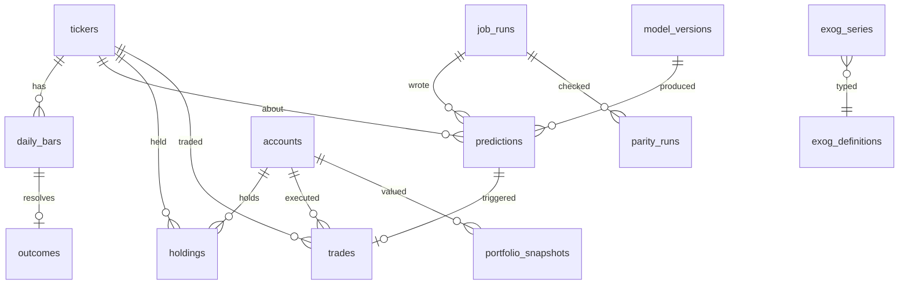

# 04 — Data Model

Postgres 16, one database `fmf`, one schema `public`. Extension: `pgcrypto` only
(`gen_random_uuid()`). No `pg_trgm` — the deleted `server/db/schema.sql` used it for company
name search, which is not in scope here.

Types are stated concretely because "we'll figure out the schema later" is how the natural key
on `predictions` gets forgotten and the job stops being idempotent.

---

## 1. Overview



Eleven tables and one view. Sizes after one year of live running, on top of the ~3 years of
backfilled history:

| Table | Rows / year | Notes |
|---|---|---|
| `daily_bars` | 24,000 | 96 × 250 |
| `exog_series` | ~6,000 | 24 series, mostly daily, macro monthly |
| `predictions` | 120,000 | 96 × 250 × 5 (4 models + ensemble) |
| `outcomes` | 24,000 | |
| `feature_rows` | 24,000 | optional, §3.4 |
| `trades` | ~10,000 | depends on signal density |
| `portfolio_snapshots` | 250 | |
| `job_runs` | ~260 | |

Total well under 250 MB with indexes. This is a small database and the schema should not
pretend otherwise.

---

## 2. Reference data

### 2.1 `tickers`

```
symbol              text        PRIMARY KEY        -- 'RELIANCE', matches the notebooks
yahoo_symbol        text        NOT NULL           -- 'RELIANCE.NS'
company_name        text
sector              text
index_membership    text        NOT NULL DEFAULT 'NIFTY100'
first_bar_date      date
is_active           boolean     NOT NULL DEFAULT true
excluded_reason     text                           -- 'insufficient_history'
created_at          timestamptz NOT NULL DEFAULT now()
```

Seeded with the 100 Nifty constituents. The four that failed
`MIN_HISTORY_DAYS = 250` — TMPV (3 bars), TATACAP (5), ENRIN (83), HYUNDAI (247) — are stored
with `is_active = false` and `excluded_reason = 'insufficient_history'` rather than deleted.
They will qualify later as history accumulates, and the record of *why* they were absent from
the first year of accuracy data is part of the evidence.

The universe is a table, not `fmf.constant.TICKERS`, because Nifty 100 membership is revised
semi-annually and a constant would make a rebalance a code deploy.

### 2.2 `exog_definitions`

```
series_code    text  PRIMARY KEY     -- 'SP500_RET', 'Interest_Rate', 'Event_Count'
group_name     text  NOT NULL        -- 'global' | 'macro' | 'gdelt'
source         text  NOT NULL        -- 'yahoo' | 'fred' | 'gdelt' | 'alphavantage'
source_key     text                  -- '^GSPC', 'FEDFUNDS'
fill_policy    text  NOT NULL        -- 'ffill' | 'zero'
publish_lag_days_expected  int       -- 1 for global, 45 for FRED monthly
CHECK (group_name IN ('global','macro','gdelt'))
CHECK (fill_policy IN ('ffill','zero'))
```

`fill_policy` is data, not a hardcoded list, because notebook 08 applies `ffill` to global and
macro and `fillna(0)` to GDELT — and that asymmetry is exactly the kind of detail that gets
reproduced wrongly when it lives as an `if` in two places (`03-feature-parity.md` §5.1).

---

## 3. Market and feature data

### 3.1 `daily_bars`

```
trade_date     date            NOT NULL
ticker         text            NOT NULL REFERENCES tickers(symbol)
open           numeric(18,6)   NOT NULL
high           numeric(18,6)   NOT NULL
low            numeric(18,6)   NOT NULL
close          numeric(18,6)   NOT NULL
volume         bigint          NOT NULL
source         text            NOT NULL DEFAULT 'yfinance'
revision       int             NOT NULL DEFAULT 0
first_seen_at  timestamptz     NOT NULL DEFAULT now()
updated_at     timestamptz     NOT NULL DEFAULT now()
PRIMARY KEY (trade_date, ticker)
CHECK (high >= low AND high >= open AND high >= close
       AND low <= open AND low <= close AND volume >= 0)
```

`numeric`, not `double precision`. Prices come from Yahoo as decimal strings; storing them as
binary floats and reading them back introduces a representation round-trip on the *input* to a
parity-critical pipeline. `numeric(18,6)` holds NSE prices exactly. Pandas converts once, on
read, deterministically.

`revision` increments when a re-fetch of an existing bar returns different values. The old
values move to `daily_bars_revisions` (same columns + `superseded_at`) — a revision must not
silently vanish, because it changes every downstream feature for that ticker from that date
forward. Handling: `05-daily-batch-job.md` §4.3.

Index: `(ticker, trade_date)` — the primary key is `(trade_date, ticker)` for the daily-slice
read, and the full-history recompute (`03-feature-parity.md` §3.4) reads per ticker in date
order, so it needs the reverse.

### 3.2 `nse_sessions`

```
session_date   date     PRIMARY KEY
is_trading_day boolean  NOT NULL
note           text                  -- 'Diwali Laxmi Pujan', 'weekend'
```

Populated from the NSE holiday calendar for the epoch year through the next calendar year.
The job consults this *before* fetching (`05-daily-batch-job.md` §4.2) — inferring "holiday"
from an empty Yahoo response conflates a market closure with an API failure, and those need
opposite responses.

It is also what the gap-completeness assertion in `03-feature-parity.md` §3.4 counts against.

### 3.3 `exog_series`

```
series_code    text            NOT NULL REFERENCES exog_definitions(series_code)
obs_date       date            NOT NULL
revision       int             NOT NULL DEFAULT 0
value          double precision NOT NULL
published_at   timestamptz     NOT NULL DEFAULT now()
source_payload jsonb                          -- raw response fragment, for audit
PRIMARY KEY (series_code, obs_date, revision)
```

`published_at` is when *this system first observed* the value — the only point-in-time fact
available without a vendor vintage feed. `revision` in the key, not overwriting, so a FRED
restatement is additive.

The serving read takes `revision ASC` (first-published), not `MAX(revision)`. Reasoning in
`03-feature-parity.md` §5.3: using the latest revision would let a March restatement change a
February prediction's inputs, which is the train/test leak arriving through the back door.

Index: `(series_code, obs_date, published_at)`.

### 3.4 `feature_rows` — optional, recommended

```
trade_date           date    NOT NULL
ticker               text    NOT NULL
feature_set_version  text    NOT NULL
features             double precision[] NOT NULL   -- 163 elements, FEATURE_ORDER order
computed_at          timestamptz NOT NULL DEFAULT now()
PRIMARY KEY (trade_date, ticker, feature_set_version)
CHECK (array_length(features, 1) = 163)
```

Not required for serving — the job recomputes the panel every day regardless
(`03-feature-parity.md` §3.4). It exists for **forensics**: when a prediction looks wrong six
months later, the exact 163-vector that produced it is the first thing anyone wants, and
reconstructing it means replaying the database as of that date.

`double precision[]` rather than 163 columns or jsonb: an array is 163 × 8 + 24 ≈ 1.3 KB per
row, ~31 MB/year, indexes positionally, and does not require a migration when the feature set
changes (the version column handles that). A jsonb object would triple the size and store 163
key strings per row.

If storage ever matters, this is the first table to prune — but at 31 MB/year it will not
matter.

---

## 4. Predictions

### 4.1 `model_versions`

```
model_version        text        PRIMARY KEY   -- 'transformer-v1.0.0'
family               text        NOT NULL      -- 'rf'|'xgb'|'lstm'|'transformer'|'ensemble'
feature_set_version  text        NOT NULL      -- 'fs-1.0.0'
input_contract       text        NOT NULL      -- 'tabular_raw' | 'scaled_sequence'
sequence_window      int                       -- 20 for scaled_sequence, NULL otherwise
n_features           int         NOT NULL      -- 163
artefact_dir         text        NOT NULL      -- '/artefacts/transformer-v1.0.0'
artefact_sha256      jsonb       NOT NULL      -- per-file digests
runtime              jsonb       NOT NULL      -- python/numpy/sklearn/xgboost/torch versions
default_threshold    numeric(5,4) NOT NULL DEFAULT 0.5000
train_start          date        NOT NULL
train_end            date        NOT NULL
test_start           date
test_end             date
test_metrics         jsonb                     -- accuracy, precision, recall, f1, roc_auc
trained_at           timestamptz NOT NULL
registered_at        timestamptz NOT NULL DEFAULT now()
is_active            boolean     NOT NULL DEFAULT false
retired_at           timestamptz
CHECK (input_contract IN ('tabular_raw','scaled_sequence','ensemble'))
CHECK (family = 'ensemble' OR sequence_window IS NOT NULL OR input_contract = 'tabular_raw')
```

`input_contract` is the field that keeps the two feed paths from `01-repository-baseline.md`
§3.1 straight: `tabular_raw` for RF and XGB (unscaled 163-vector), `scaled_sequence` for LSTM
and Transformer (scaler-transformed, `(20, 163)`). The inference dispatcher reads this column
rather than pattern-matching on the family name.

`is_active` drives what the daily job scores. Several versions of one family may be active at
once — the supported way to compare a new model against the incumbent on identical forward
days (`03-feature-parity.md` §8.3).

### 4.2 `predictions`

```
prediction_id        bigserial   PRIMARY KEY
trade_date           date        NOT NULL          -- the date whose features were used
target_date          date        NOT NULL          -- the session whose direction is predicted
ticker               text        NOT NULL REFERENCES tickers(symbol)
model_version        text        NOT NULL REFERENCES model_versions(model_version)
feature_set_version  text        NOT NULL
prob_up              double precision NOT NULL
pred_label           smallint    NOT NULL          -- 1 = UP, 0 = DOWN
threshold_used       numeric(5,4) NOT NULL
origin               text        NOT NULL
run_id               uuid        NOT NULL REFERENCES job_runs(run_id)
exog_staleness       jsonb                          -- {"global":1,"macro":34,"gdelt":0}
created_at           timestamptz NOT NULL DEFAULT now()

CONSTRAINT uq_prediction UNIQUE (trade_date, ticker, model_version)
CHECK (prob_up >= 0 AND prob_up <= 1)
CHECK (pred_label IN (0,1))
CHECK (origin IN ('live','backfill_oos','backfill_insample'))
CHECK (target_date > trade_date)
```

**`UNIQUE (trade_date, ticker, model_version)` is the load-bearing constraint of this schema.**
It does three jobs:

1. **Idempotency.** A double-run inserts with `ON CONFLICT DO NOTHING` and writes zero extra
   rows. No dedupe pass, no "did it already run" flag to get wrong.
2. **Model-swap safety.** A retrained model has a new `model_version`, so it inserts alongside
   rather than over. Accuracy history per version stays intact
   (`03-feature-parity.md` §8.1).
3. **Backfill/live collision.** A backfill for a date already predicted live cannot overwrite
   it, and vice versa. The first writer wins, permanently.

`origin` is a three-value enum, not a boolean, and this matters more than it looks —
`10-backfill-and-accuracy.md` §2 argues it out. Briefly: rows backfilled for dates inside the
training window (2023-04-18 → 2024-12-31) are **in-sample** and are not evidence of anything;
rows backfilled for 2025 are out-of-sample but were computed with the outcome already knowable;
only `live` rows are forward-tested. Collapsing these into "backfill vs live" would let
in-sample rows inflate the historical accuracy chart.

`origin` is immutable — enforced by a `BEFORE UPDATE` trigger that raises on any change to
`origin`, `prob_up`, `pred_label`, `model_version` or `trade_date`. A prediction is a
historical fact; nothing in the application has a legitimate reason to edit one.

`target_date` is stored explicitly rather than derived as "the next row in `nse_sessions`",
because a Friday prediction targets Monday and a pre-holiday prediction targets the session
after the holiday. Deriving it at query time means every consumer re-implements the calendar.

Indexes:
```
uq_prediction                                        (unique, serves the daily-slice read)
idx_pred_ticker_date   (ticker, trade_date DESC)     -- ticker detail page
idx_pred_model_date    (model_version, trade_date)   -- accuracy aggregation
idx_pred_origin_date   (origin, trade_date)          -- provenance-filtered charts
```

### 4.3 `outcomes`

```
trade_date      date             NOT NULL
ticker          text             NOT NULL REFERENCES tickers(symbol)
target_date     date             NOT NULL
close_t         numeric(18,6)    NOT NULL
close_t1        numeric(18,6)    NOT NULL
realised_label  smallint         NOT NULL   -- 1 if close_t1 > close_t else 0
realised_return double precision NOT NULL   -- close_t1/close_t - 1
resolved_at     timestamptz      NOT NULL DEFAULT now()
revised_at      timestamptz
PRIMARY KEY (trade_date, ticker)
CHECK (realised_label IN (0,1))
```

Separate from `predictions`, deliberately — one outcome serves all five model versions that
predicted that `(date, ticker)`. Putting `realised_label` on `predictions` would store it five
times and permit five inconsistent copies.

`realised_label = (close_t1 > close_t)` reproduces notebook 11's `create_target` exactly,
including the tie convention: an unchanged close is DOWN, because `>` is strict. That is a real
convention with real consequences (a flat close is scored against every UP prediction), and it
must match training, not be quietly "improved" to `>=`.

`revised_at` is set if a bar revision changes `close_t` or `close_t1` after resolution. The
outcome is corrected; the **prediction is never touched**. That asymmetry is the point of
forward testing.

---

## 5. Accuracy

`accuracy_daily` — a materialised view, refreshed at the end of each job run. 250 rows per
model per year; a plain view would also work, but materialising keeps the dashboard's
cumulative-accuracy query off a repeated join.

```sql
CREATE MATERIALIZED VIEW accuracy_daily AS
SELECT
  p.trade_date,
  p.model_version,
  p.origin,
  count(*)                                              AS n,
  count(*) FILTER (WHERE p.pred_label = o.realised_label) AS n_correct,
  avg((p.pred_label = o.realised_label)::int)           AS accuracy,
  -- majority baseline: always predict UP
  avg((o.realised_label = 1)::int)                      AS baseline_up_rate,
  greatest(avg((o.realised_label = 1)::int),
           1 - avg((o.realised_label = 1)::int))        AS baseline_majority,
  avg(p.prob_up)                                        AS mean_prob_up
FROM predictions p
JOIN outcomes o
  ON o.trade_date = p.trade_date AND o.ticker = p.ticker
GROUP BY p.trade_date, p.model_version, p.origin;

CREATE UNIQUE INDEX ON accuracy_daily (trade_date, model_version, origin);
```

Grouping by `origin` at the view level rather than filtering in the API means no endpoint can
accidentally sum across provenance tiers. Confidence intervals are computed in the API from
`n` and `n_correct` (`10-backfill-and-accuracy.md` §4), not stored.

The `INNER JOIN` means unresolved predictions (today's, which have no outcome until tomorrow)
are simply absent. Correct: they are not yet evidence.

---

## 6. Paper portfolio

### 6.1 `accounts`

```
account_id       uuid          PRIMARY KEY DEFAULT gen_random_uuid()
label            text          NOT NULL          -- 'paper-transformer-v1.0.0'
model_version    text          REFERENCES model_versions(model_version)
starting_cash    numeric(18,2) NOT NULL
cash             numeric(18,2) NOT NULL
cost_model       jsonb         NOT NULL          -- see 07-paper-portfolio.md §2
sizing_policy    jsonb         NOT NULL
is_active        boolean       NOT NULL DEFAULT true
created_at       timestamptz   NOT NULL DEFAULT now()
```

An account is bound to one `model_version`. Running a paper account per active model is the
only way to attribute P&L to a model; a single account fed by a blend attributes nothing.
`12-out-of-scope.md` confirms this is not multi-user — these are strategy accounts under one
operator.

All money is `numeric`, never float. Non-negotiable.

### 6.2 `holdings`

```
account_id   uuid          NOT NULL REFERENCES accounts(account_id)
ticker       text          NOT NULL REFERENCES tickers(symbol)
quantity     integer       NOT NULL
avg_cost     numeric(18,6) NOT NULL   -- includes buy-side costs, see 07 §3
opened_at    date          NOT NULL
updated_at   timestamptz   NOT NULL DEFAULT now()
PRIMARY KEY (account_id, ticker)
CHECK (quantity > 0)
```

Rows are deleted on full exit rather than kept at zero. History lives in `trades`.

### 6.3 `trades`

```
trade_id        bigserial     PRIMARY KEY
account_id      uuid          NOT NULL REFERENCES accounts(account_id)
trade_date      date          NOT NULL
ticker          text          NOT NULL REFERENCES tickers(symbol)
side            text          NOT NULL          -- 'BUY' | 'SELL'
quantity        integer       NOT NULL CHECK (quantity > 0)
price           numeric(18,6) NOT NULL          -- fill price before costs
gross_value     numeric(18,2) NOT NULL
costs           numeric(18,2) NOT NULL
cost_breakdown  jsonb         NOT NULL          -- {stt, exchange, sebi, stamp, gst, slippage}
net_value       numeric(18,2) NOT NULL
realised_pnl    numeric(18,2)                   -- SELL only, net of both legs' costs
prediction_id   bigint        REFERENCES predictions(prediction_id)
run_id          uuid          NOT NULL REFERENCES job_runs(run_id)
created_at      timestamptz   NOT NULL DEFAULT now()
CHECK (side IN ('BUY','SELL'))
UNIQUE (account_id, trade_date, ticker, side)
```

`prediction_id` is the audit link from money back to signal — it is what makes "which
predictions actually made money" a query rather than a reconstruction.

`UNIQUE (account_id, trade_date, ticker, side)` gives settlement the same idempotency the
prediction key gives inference: a re-run cannot double-execute.

`cost_breakdown` is itemised because the total is an aggregate of five statutory charges with
different bases, and a single number cannot be audited (`07-paper-portfolio.md` §2).

### 6.4 `portfolio_snapshots`

```
account_id        uuid          NOT NULL REFERENCES accounts(account_id)
trade_date        date          NOT NULL
cash              numeric(18,2) NOT NULL
holdings_value    numeric(18,2) NOT NULL   -- marked at that date's close
equity            numeric(18,2) NOT NULL   -- cash + holdings_value
realised_pnl_cum  numeric(18,2) NOT NULL
unrealised_pnl    numeric(18,2) NOT NULL
costs_cum         numeric(18,2) NOT NULL
n_positions       integer       NOT NULL
created_at        timestamptz   NOT NULL DEFAULT now()
PRIMARY KEY (account_id, trade_date)
```

Written once per session. The equity curve is a table read, not a replay of `trades` — 250
rows a year is not worth recomputing, and a stored curve is auditable against the trade log.

`costs_cum` is separate so the dashboard can show gross-of-cost against net-of-cost. On a
strategy with a 0.64pp edge and ~0.25% round-trip costs (`07-paper-portfolio.md` §2), that gap
is the most informative number on the page.

---

## 7. `job_runs`

```
run_id        uuid        PRIMARY KEY DEFAULT gen_random_uuid()
job_name      text        NOT NULL       -- 'daily_inference' | 'backfill' | 'settle'
trade_date    date
attempt       int         NOT NULL DEFAULT 1
status        text        NOT NULL
started_at    timestamptz NOT NULL DEFAULT now()
finished_at   timestamptz
rows_written  jsonb                      -- {"predictions":480,"outcomes":96,"trades":11}
error_class   text
error_detail  text
host_image    text                       -- container image sha
CHECK (status IN ('running','succeeded','skipped_holiday','skipped_duplicate',
                  'failed_fetch','failed_parity','failed_stale_exog',
                  'failed_artefact','failed_incomplete_history','failed_other'))
```

The status enum is the failure-mode list from `05-daily-batch-job.md` §4, made queryable. A
generic `'failed'` would force log-grepping to answer "how often does the fetch flake", which
is precisely the question an operator asks in month three.

Index: `(job_name, trade_date DESC)`.

This table *is* the monitoring (`02-architecture.md` §7). The alert is a query against it.

---

## 8. `parity_runs`

```
parity_run_id       bigserial   PRIMARY KEY
run_id              uuid        REFERENCES job_runs(run_id)
feature_set_version text        NOT NULL
n_samples           int         NOT NULL
max_deviation       double precision NOT NULL
worst_column        text
tolerance           double precision NOT NULL DEFAULT 1e-9
passed              boolean     NOT NULL
per_column_top10    jsonb       NOT NULL
checked_at          timestamptz NOT NULL DEFAULT now()
```

One row per parity assertion — CI runs and daily runs both. `max_deviation` over time is the
early-warning signal: a value creeping from 1e-14 toward the 1e-9 tolerance means something is
drifting before it fails. `03-feature-parity.md` §6.3.

---

## 9. Retention and backup

| Table | Retention |
|---|---|
| `predictions`, `outcomes`, `trades`, `portfolio_snapshots`, `parity_runs` | forever — this is the evidence |
| `daily_bars`, `daily_bars_revisions`, `exog_series` | forever — required to recompute any historical panel |
| `feature_rows` | 24 months, then prune; recoverable by replay |
| `job_runs` | forever, it is tiny |

`pg_dump -Fc` nightly after the job, 30 daily + 12 monthly copies retained. The database is
under 250 MB; a compressed dump is a few tens of MB. Restore is tested once, at build time, by
restoring into a scratch container and running the parity check against it — which validates
the backup and the parity fixture in the same step.
