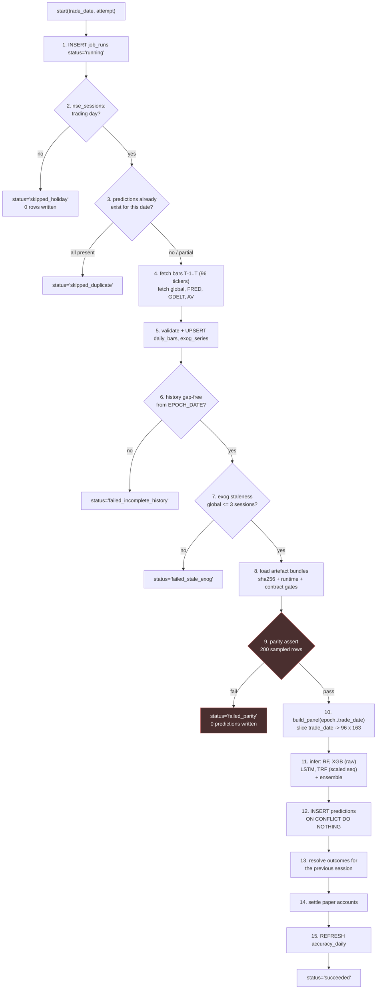

# 05 — The Daily Batch Job

`fmf.pipeline.daily_inference_pipeline`. One run per trading day. ~96 rows in, ~480 prediction
rows out. Total expected wall time under two minutes, dominated by the external fetch.

---

## 1. Timing

NSE regular session: 09:15–15:30 IST. Yahoo's daily bar for an NSE symbol is typically final
within 30–60 minutes of close, but consolidated volume can settle later.

**Scheduled at 18:30 IST (13:00 UTC).** Three hours after close. Rationale for the size of the
gap: the cost of running late is nothing — nobody is trading on it until the next morning's
open. The cost of running early is a partial bar entering the feature panel, which is a
parity break (§4.4). Asymmetric costs, so pick the late side generously.

A second, idempotent attempt is scheduled at 20:30 IST. Because of the natural key on
`predictions` (`04-data-model.md` §4.2) this is safe: if the 18:30 run succeeded, the 20:30 run
writes zero rows and exits `skipped_duplicate`. If 18:30 failed on a transient fetch error,
20:30 recovers it without human involvement. Two cron lines buy most of what a retry framework
would.

---

## 2. Orchestration: host cron, not Airflow

**Decision: `crontab` on the host, invoking `docker compose run --rm job`.**

The workload is one job, one schedule, zero fan-out, zero inter-task dependencies beyond a
linear sequence inside a single Python process. Airflow's value — DAG dependency resolution,
per-task retry, backfill orchestration, a scheduler UI — costs a webserver, a scheduler, a
metadata database and an executor to deliver a linear sequence of eight function calls.

What is given up, and the substitute:

| Airflow gives | Substitute here |
|---|---|
| Per-task retry | The second cron attempt at 20:30, made safe by the natural key |
| Run history UI | `job_runs` table + the API's `/admin/runs` endpoint |
| Backfill orchestration | `fmf.pipeline.backfill_pipeline`, a one-shot script (`10-backfill-and-accuracy.md` §3) |
| Alerting | One cron line: query `job_runs`, email if no success by 20:00 |
| SLA tracking | `job_runs.started_at`/`finished_at` |

The condition that would reverse this: more than three independent scheduled jobs with real
dependency edges between them. Not before.

---

## 3. Sequence

### Ordering constraints that are not arbitrary

- **Calendar check before fetch (2 before 4).** Fetching on a holiday and inferring closure
  from an empty response conflates a market holiday with an API outage. Those have opposite
  correct responses: one is a normal no-op, the other is an alert.
- **Parity assertion before feature slice, and before inference (9 before 10/11).** It runs
  against the live database and the just-loaded artefacts, so it catches a hand-swapped model
  file or a rewritten historical bar. In CI only, it would not.
- **Predictions before outcomes (12 before 13).** Both are writes to the same transaction
  scope; ordering them this way means a failure during outcome resolution leaves today's
  predictions intact and yesterday's outcomes recoverable by the next run's step 13. The
  reverse ordering can lose a day of predictions to an unrelated settlement bug.
- **Settlement after outcomes (14 after 13).** The portfolio exits positions at the realised
  close, which step 13 has just recorded.

### Transaction boundaries

Steps 5, 12, 13, 14 each run in their own transaction. Not one big transaction: a failure in
settlement should not roll back the day's predictions, because predictions are the primary
evidence and settlement is derived. Each step is individually idempotent via its natural key,
so partial completion is recoverable by re-running the whole job.

---

## 4. Failure modes

Each with a detection method, a `job_runs.status`, and a concrete mitigation. This list is the
`CHECK` constraint on `job_runs.status` (`04-data-model.md` §7) — the enum and this table are
maintained together.

### 4.1 A data source is down or rate-limited

**Detection:** HTTP error, timeout, or an empty frame from a source that
`nse_sessions`/`exog_definitions` says should have data.

**Per source:**

| Source | Behaviour | Mitigation |
|---|---|---|
| **Yahoo bars** | Hard dependency. No bars, no prediction. | 3 retries, exponential backoff 5s/20s/60s, jittered. Fetch in chunks of 20 symbols. If any *active* ticker still has no bar → `failed_fetch`, no predictions written for any ticker. Partial-universe predictions are rejected because the paper portfolio's cross-sectional sizing (`07` §4) would be computed over a biased subset. |
| **Yahoo global proxies** | Hard dependency — 24 of 163 features. | Same retry. On persistent failure, fall through to the staleness gate (§4.7). |
| **FRED** | Soft. Monthly series with an expected 2–6 week lag; a missing day is normal. | `ffill` from the last observation, exactly as training did. Record `exog_staleness.macro`. |
| **GDELT** | Soft. `fill_policy = 'zero'`. | `fillna(0)`, exactly as training did. But: a *silent* zero is indistinguishable from a genuine quiet day, so `exog_staleness.gdelt` records the gap explicitly and the dashboard surfaces it. |
| **Alpha Vantage** | Free tier: 25 requests/day. A 96-ticker sweep does not fit. | Not on the daily critical path. News sentiment did not survive into the 163-feature set — the merged panel's news columns were dropped upstream of notebook 11. Fetch on a rolling 25-tickers-per-day rotation for future work; a failure never blocks the job. |

### 4.2 The exchange was closed

**Detection:** `nse_sessions.is_trading_day = false`, checked before any network call.

**Mitigation:** `status = 'skipped_holiday'`, zero rows written, exit 0. No alert.

**The failure to avoid:** writing a prediction for a non-session using the previous session's
features. That would insert a duplicate-featured row that resolves against a `close_t1` from a
session two days later, quietly corrupting both the accuracy record and the portfolio.

**Operational dependency:** `nse_sessions` must be populated before the year begins. A missing
future year means the job treats a real session as a holiday and silently skips it. Guard: the
job raises `failed_other` if `nse_sessions` has no rows beyond `trade_date + 30 days`.

### 4.3 A partial or revised bar arrives

Two distinct problems.

**Revised historical bar.** Each run re-fetches the previous 5 sessions of bars and compares
against stored values.

- Difference found → increment `daily_bars.revision`, archive the prior row to
  `daily_bars_revisions`, write the new values.
- Because the panel is fully recomputed from the epoch every day
  (`03-feature-parity.md` §3.4), **all downstream features self-heal on the next run**. No
  cascade recomputation needed. This is a direct payoff of the epoch-recompute decision.
- If the revision changes a `close_t` or `close_t1` already in `outcomes`, recompute
  `realised_label` and set `outcomes.revised_at`. **`predictions` is not touched** — the
  prediction was made on the information available then, which is the entire premise of
  forward testing.
- Log `revision_count` in `job_runs.rows_written`. A spike means the upstream source is
  unstable and the accuracy numbers deserve a caveat.

**Partial current bar.** Detected by three checks on the `trade_date` bar:

1. `volume > 0` — a partial or placeholder bar frequently has zero volume.
2. `high >= max(open, close)` and `low <= min(open, close)` — a mid-session bar can violate
   this as it updates.
3. The bar's date equals the expected session date, not a stale prior session.

Any failure for any active ticker → `failed_fetch`, no predictions. The 20:30 retry then has
two more hours of settlement time. This is why the retry exists.

### 4.4 The job runs twice

**Mitigation, primary:** `UNIQUE (trade_date, ticker, model_version)` on `predictions`, with
`INSERT ... ON CONFLICT DO NOTHING`. A second run inserts zero rows. This is structural — it
holds even if every other guard is bypassed, including a manual invocation.

**Mitigation, secondary:** step 3 counts existing predictions for `trade_date` across active
model versions. If the count equals `n_active_tickers × n_active_versions`, exit
`skipped_duplicate` before spending the fetch.

**Trades:** `UNIQUE (account_id, trade_date, ticker, side)` gives settlement the same property.

**Outcomes:** `PRIMARY KEY (trade_date, ticker)` with `ON CONFLICT DO UPDATE` — outcomes are
idempotent by recomputation from stored bars, so re-resolving is harmless and is how the
revision path in §4.3 corrects them.

**Concurrency:** the job takes `pg_advisory_lock(hashtext('fmf_daily_inference'))` at start
and holds it for the run. Two simultaneous invocations (a manual run overlapping the cron) do
not interleave; the second blocks, then finds the work done and exits `skipped_duplicate`.

### 4.5 A model file fails to load

**Detection:** the four gates in `03-feature-parity.md` §4.3 — sha256 mismatch, runtime version
mismatch, feature-order mismatch, `scaler.n_samples_seen_` mismatch — plus ordinary unpickling
and `load_state_dict` errors.

**Mitigation:** `status = 'failed_artefact'`, alert, **and no partial write**. All active
bundles are loaded and verified *before* any inference runs, so a broken Transformer bundle does
not result in a day where RF and XGB have predictions and the others do not.

That is a deliberate choice over the alternative (score the models that loaded, skip the rest).
Partial days make the per-model accuracy series non-comparable — model A would be evaluated on
a different set of days than model B, and with a 0.64pp edge under measurement, unequal day
sets are a bigger error source than the missing day.

The recovery is a redeploy of the correct artefact directory followed by a backfill for the
missed dates, tagged `backfill_oos` so the gap is visible in the provenance record
(`10-backfill-and-accuracy.md`).

### 4.6 History is not gap-free

**Detection:** per active ticker, `count(daily_bars) BETWEEN EPOCH_DATE AND trade_date` must
equal `count(nse_sessions WHERE is_trading_day)` over the same range.

**Why it matters:** a missing bar shifts every rolling window and every recursive indicator for
that ticker from the gap onward. `Volatility_50` computed over 49 real bars plus one skipped
session is not the training-time `Volatility_50`. Nothing raises; the number is merely wrong.

**Mitigation:** attempt an automatic backfill of the missing dates from Yahoo in-line. If the
gap persists, mark that ticker `skip_today` and — critically — **still write no predictions for
it**, rather than writing predictions from a gapped panel. If more than 5% of active tickers
are gapped, `failed_incomplete_history` for the whole run.

A ticker legitimately without history (a newly-added constituent) is handled by `is_active` and
`first_bar_date` on `tickers`, not by this check.

### 4.7 Exogenous data is stale

**Detection:** `exog_staleness_days` per group, computed in step 7.

**Mitigation:**

| Group | Threshold | Action |
|---|---|---|
| `global` | > 3 sessions | `failed_stale_exog`, no predictions. 24 of 163 features (~15%) — a stale global block makes this a different model, not a degraded one. |
| `macro` | none | Expected to be 20–45 days stale by construction. Recorded, never blocks. |
| `gdelt` | > 5 sessions | Warn, proceed with zero-fill, record. GDELT is 7 raw + 21 lagged features but is zero-filled by training convention, so a gap is in-distribution. |

Every prediction row carries its `exog_staleness` jsonb, so a post-hoc question — "was accuracy
worse on stale-macro days?" — is a `GROUP BY`, not a forensic exercise.

### 4.8 Feature parity fails

**Detection:** step 9, `03-feature-parity.md` §6.

**Mitigation:** `failed_parity`, zero predictions, alert with `worst_column` and
`max_deviation` from the `parity_runs` row.

This is the one failure that should never auto-recover. A parity break means the serving
feature path has diverged from training; retrying it produces the same divergence. It needs a
human to read `parity_runs.per_column_top10` and find out what changed — a pandas upgrade, a
`ta` upgrade, a rewritten bar, or a code change that slipped past CI.

---

## 5. Runtime budget

| Step | Expected |
|---|---|
| Fetch bars (96 symbols, chunked) | 20–60 s |
| Fetch exogenous (7 global + 3 FRED + GDELT) | 5–15 s |
| Read full panel from Postgres (~71k rows) | < 2 s |
| `build_panel` full recompute | 5–20 s |
| Parity assertion (200 rows) | 5–15 s |
| RF + XGB inference (96 × 163) | < 1 s |
| LSTM + Transformer inference (96 × 20 × 163, CPU) | < 2 s |
| Writes (~600 rows total) | < 1 s |
| **Total** | **~1–2 minutes**, ≥ 60% of it network |

The compute is negligible and the fetch dominates. That ratio is what makes the "just recompute
everything from the epoch" decision in `03-feature-parity.md` §3.4 free in practice, and it is
what `11-trade-offs.md` §3 revisits at 10x.

---

## 6. What the job does not do

- **It does not train.** Training is `fmf.pipeline.training_pipeline`, run by hand, producing a
  new immutable artefact directory and a new `model_versions` row.
- **It does not serve.** The API never invokes it; it never invokes the API.
- **It does not adapt.** No online learning, no scaler refit, no threshold retune. Every fitted
  quantity is loaded from an artefact whose sha256 is verified. That constraint is the whole
  point of `03-feature-parity.md`.
