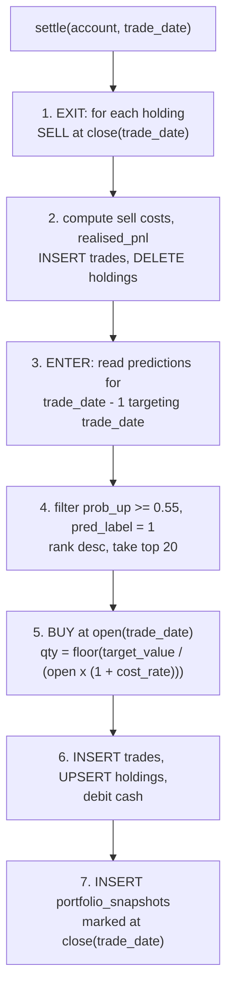

# 07 — Paper Portfolio

Paper trading against real fetched prices. No matching engine, no order book, no simulated
price generator — every fill price is a real bar value from `daily_bars`.

---

## 1. The prediction/execution mismatch, stated first

The models predict **`close(t+1) > close(t)`** — that is notebook 11's `create_target`, and it
is the quantity every metric in `dl_metrics_summary.json` describes.

A portfolio cannot trade that. The prediction is produced at 18:30 IST on day *t*, after the
close. The earliest executable price is `open(t+1)`. So the portfolio captures
**`close(t+1) / open(t+1) − 1`**, while the model was evaluated on
**`close(t+1) / close(t) − 1`**.

These are different bets. The overnight gap — `open(t+1) / close(t) − 1` — is captured by
neither, and on Indian equities it is a material fraction of daily variance.

**Design response: record both, per trade.**

```
trades.signal_return   = close(t+1)/close(t) - 1     what the model predicted
trades.realised_return = close(t+1)/open(t+1) - 1    what the portfolio got
```

The dashboard shows the two side by side. A model that is directionally right close-to-close
but loses money open-to-close is a real and interesting result, and it is invisible if only P&L
is reported. Papering over the gap by pretending the portfolio trades at `close(t)` would be a
lookahead — it would execute at a price that existed before the prediction did.

---

## 2. Cost model

Indian delivery equity charges. Stored per account as `accounts.cost_model` jsonb, itemised
per trade in `trades.cost_breakdown` (`04-data-model.md` §6.3) — a single total cannot be
audited against a broker statement.

| Charge | Rate | Basis |
|---|---|---|
| Brokerage | 0.00% (configurable) | turnover; discount-broker delivery default |
| STT | 0.100% | turnover, **both sides** (delivery) |
| Exchange transaction charge (NSE) | 0.00297% | turnover, both sides |
| SEBI turnover fee | 0.0001% | turnover, both sides |
| Stamp duty | 0.015% | turnover, **buy side only** |
| GST | 18% | on (brokerage + exchange charge + SEBI fee) |
| DP charge | ₹15.34 | flat, per scrip, **sell side only** |
| Slippage | 5 bps | modelling assumption, both sides |

### 2.1 Worked round trip on ₹1,00,000

| | Buy | Sell |
|---|---|---|
| STT | 100.00 | 100.00 |
| Exchange | 2.97 | 2.97 |
| SEBI | 0.10 | 0.10 |
| Stamp | 15.00 | — |
| GST (18% of 3.07) | 0.55 | 0.55 |
| DP | — | 15.34 |
| **Statutory subtotal** | **118.62** | **118.96** |
| Slippage (5 bps) | 50.00 | 50.00 |
| **Total** | **168.62** | **168.96** |

**Round trip ≈ ₹337.58 on ₹1,00,000 = 0.338%.**

### 2.2 What that number means here

From the panel, `Volatility_20` centres around 0.015 — a ~1.5% daily standard deviation, so a
mean absolute daily move around **1.2%**.

**Costs consume roughly 28% of a typical daily move.** A one-day-horizon strategy that trades
in and out every session must be right often enough to clear 0.34% per round trip, and the best
model's measured edge is 0.64 percentage points of directional accuracy over a coin flip.

Rough arithmetic: an edge of `p = 0.5064` on a symmetric ±1.2% move yields an expected gross
return per trade of `(2p − 1) × 1.2% = 0.015%`. Against 0.338% of cost, that is **negative by
more than an order of magnitude**.

**This is a designed-in result, not a bug in the design.** The paper portfolio's job in this
phase is to measure that gap honestly and display it, because "the classifier is slightly
better than chance and the strategy still loses to costs" is a legitimate and publishable
finding — and it is the finding the numbers currently point at. A portfolio configured to hide
it (by omitting costs, or by trading at `close(t)`) would be the bug.

The `costs_cum` column on `portfolio_snapshots` exists precisely so the dashboard can plot
gross-of-cost against net-of-cost equity. That single chart is the most informative artefact
this phase produces.

### 2.3 Slippage

5 bps is an assumption, and it is labelled as one in the UI. Nifty 100 constituents are liquid
and a small paper account moves nothing, so 5 bps is conservative-to-realistic for market
orders at the open. It is configurable per account; changing it creates a new account rather
than restating an existing one, so the equity curve is never retroactively rewritten.

---

## 3. Position accounting

**Average cost, buy side:**

```
new_avg_cost = (old_qty × old_avg_cost + fill_qty × fill_price + buy_costs) / (old_qty + fill_qty)
```

Buy-side costs capitalise into `avg_cost`. Sell-side costs are deducted from proceeds.
Consequence: `unrealised_pnl` is already net of entry costs, and `realised_pnl` on exit is net
of both legs. No cost is counted twice and none is dropped.

**Realised P&L on a sell of `q` units:**

```
proceeds     = q × fill_price − sell_costs
cost_basis   = q × avg_cost
realised_pnl = proceeds − cost_basis
```

Weighted-average cost, not FIFO. Justification: there is no tax computation in scope
(`12-out-of-scope.md`), positions are held ~1 day so lot identity rarely matters, and WAC is one
number per holding rather than a lot table. If short-term/long-term capital gains ever enter
scope, this becomes FIFO and `holdings` gains a lot ledger.

**Integer quantities.** Whole shares only; fractional shares do not exist on NSE. Sizing rounds
down, which slightly under-deploys cash — recorded, not corrected.

All money is `numeric` in Postgres and `Decimal` in Python. No float touches a currency value.

---

## 4. Sizing and signal policy

Defaults, stored in `accounts.sizing_policy`:

```json
{
  "starting_cash": 1000000,
  "max_positions": 20,
  "position_sizing": "equal_weight",
  "target_weight": 0.05,
  "min_probability": 0.55,
  "long_only": true,
  "hold_days": 1,
  "cash_buffer": 0.02
}
```

- **Long only.** Short selling next-day on NSE requires intraday square-off or SLB; modelling
  it correctly is more work than the signal justifies. DOWN predictions produce no trade, only
  an exit if the position is held. Stated as a limitation.
- **`min_probability = 0.55`.** Not every UP prediction is traded. Notebook 18 (selective
  prediction and confidence strategy) established the principle; this applies it as a simple
  probability gate. With the models clustered near 0.50, this will fire on few names — which is
  itself informative and will be visible as low deployment on the dashboard.
- **`max_positions = 20`** of 96 tickers, ranked by `prob_up` descending among those above the
  gate. Equal weight at 5% of starting equity.
- **`hold_days = 1`.** Enter at `open(t+1)`, exit at `close(t+1)`. This matches the prediction
  horizon and is why §1's mismatch exists.
- **`cash_buffer = 2%`** so cost estimates never overdraw the account. An order that would
  overdraw is skipped and logged, not partially filled.

One account per active model version (`04-data-model.md` §6.1) — attributing P&L requires it.

---

## 5. Settlement

Runs as step 14 of the daily job, after outcomes are resolved.



**Exit before enter.** Cash from today's exits funds today's entries, which is what a real
account does under T+1 settlement.

**The trade for a prediction made on day *t* is executed during the settlement run of day
*t+1*.** So on any given evening, the job enters positions from *yesterday's* signal using
*today's* prices, both of which it now has. There is no forward-looking step and nothing is
executed at a price that did not exist when the signal was produced.

**Idempotency** via `UNIQUE (account_id, trade_date, ticker, side)`. A re-run cannot
double-execute. `portfolio_snapshots` has `PRIMARY KEY (account_id, trade_date)` with
`ON CONFLICT DO UPDATE` — recomputation from the trade log is deterministic, so overwriting a
snapshot is safe in a way overwriting a trade is not.

**Missing bar on settlement day:** if a held ticker has no `open` or `close` for `trade_date`
(suspension, halt), the position is **carried, not force-exited at a stale price**. Marked at
its last available close, flagged `stale_mark = true` on the snapshot. Fabricating a fill at a
price that did not trade would be the simulated-price-generator the constraints forbid.

---

## 6. Metrics

Computed from `portfolio_snapshots` and `trades`, served by `08-read-api.md` §3:

| Metric | Definition |
|---|---|
| Equity curve | `portfolio_snapshots.equity` over time |
| Total return | `equity / starting_cash − 1` |
| Gross vs net | `equity + costs_cum` against `equity` — the §2.2 chart |
| Realised / unrealised P&L | from snapshots |
| Hit rate | share of closed trades with `realised_pnl > 0` |
| Average trade | mean `realised_pnl` per closed trade |
| Max drawdown | peak-to-trough on the equity curve |
| Deployment | `n_positions / max_positions` — how often the gate fires |
| Cost drag | `costs_cum / starting_cash` |

**No Sharpe ratio in this phase.** A Sharpe on 250 daily observations of a near-zero-edge
strategy has a standard error wide enough to be uninformative, and reporting it invites
over-reading. Total return, drawdown, cost drag and hit rate say everything the data supports.
Risk-adjusted metrics belong with notebooks 24–25's work, which is out of scope
(`12-out-of-scope.md`).

**Benchmark:** buy-and-hold `^NSEI` over the same window, same starting cash, one entry cost.
Absolute return on a paper account is meaningless without it.
