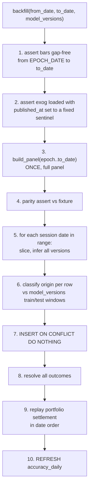

# 10 — Backfill and Accuracy Provenance

The accuracy record is the project's primary output. This file specifies how it is bootstrapped
without contaminating it.

---

## 1. Why backfill at all

On day one of live running, the accuracy page shows nothing. After a week it shows ~480
predictions with a 95% interval roughly ±4.5 percentage points — wide enough to contain both
"no skill" and "twice the claimed edge". A year of live running is needed before the chart says
anything (§4).

Backfill produces prediction rows for past dates so the system has a populated history from the
first day: the charts render, the portfolio has an equity curve, the queries are exercised on
realistic volumes, and the ticker detail pages are not empty.

The danger is equally clear. A backfilled prediction is generated with the outcome already
sitting in the database. It is not a forecast; it is a re-scoring. Presenting it beside live
rows would turn a year of honest forward-testing into a restated backtest with extra steps.

---

## 2. Three provenance tiers, not two

`predictions.origin` is a three-value enum (`04-data-model.md` §4.2). A boolean would be wrong,
because "backfill" covers two categories with entirely different evidential status.

| `origin` | Dates | What it is | Evidential status |
|---|---|---|---|
| `backfill_insample` | 2023-04-18 → 2024-12-31 | Re-scoring the model's own **training data** | **None.** Accuracy here reflects memorisation. Expect it to look good. It means nothing. |
| `backfill_oos` | 2025-01-01 → deploy date | Re-scoring the held-out test period | Weak. Genuinely out-of-sample for the model, but this window is what `optimized_threshold.json` and `ensemble_config.json` were tuned on, and it is what every reported metric already describes. Reporting it as new evidence double-counts. |
| `live` | deploy date → present | Predicted before the outcome existed | **This is the evidence.** The only tier where the system did not have access to the answer. |

The tier boundaries come from `model_versions.train_start`/`train_end`/`test_end`, so they are
derived per model version rather than hardcoded. A model retrained on data through 2025-12-31
would shift its own `backfill_insample` boundary accordingly, automatically.

**Enforcement, at three levels:**

1. **Schema.** `origin` is immutable — a `BEFORE UPDATE` trigger raises on any attempt to change
   it (`04-data-model.md` §4.2).
2. **View.** `accuracy_daily` groups *by* `origin`. No aggregation in the database can blend
   tiers.
3. **API.** `GET /api/v1/accuracy` requires `origin` and offers no "all" value
   (`08-read-api.md` §3).

Three independent layers for one property, because a single misplaced `GROUP BY` in a chart
query is all it takes to publish a number that is 60% memorisation. The cost of the redundancy
is a few lines; the cost of the failure is the credibility of the whole result.

---

## 3. The backfill procedure

`fmf.pipeline.backfill_pipeline`. One-shot, manual, run once after the schema and bar history
are loaded.



### 3.1 Points that matter

**Step 3 — one panel build, not one per date.** Backfilling 700 sessions by calling
`build_panel(as_of=d)` 700 times would recompute the full history 700 times. Build once, slice
700 times. This is the *only* place a bulk path is permitted, and it is safe precisely because
`as_of` never changes what is computed (`03-feature-parity.md` §2.2) — the sliced rows are
identical to what 700 separate calls would produce. That equivalence is worth a test.

**Step 4 — the same parity assertion as the daily job.** A backfill that skips it can silently
inject 700 sessions of skewed predictions into the historical record, which is worse than
having no history.

**Step 7 — `ON CONFLICT DO NOTHING`, never `DO UPDATE`.** If a live prediction already exists
for a `(date, ticker, model_version)`, the backfill must not touch it. First writer wins,
permanently. This is what stops a re-run of the backfill after six months of live operation from
overwriting six months of forward-tested rows with re-scored ones — the single most damaging
mistake available in this system, and it is prevented structurally rather than by procedure.

**Step 2 — `published_at` sentinel.** Backfilled exogenous rows have no honest observation
time. They are loaded with `published_at` set to their `obs_date + expected_publication_lag`
from `exog_definitions`, and `source_payload.backfilled = true`. This is an approximation and
it is recorded as one. It also means `exog_staleness` on backfilled prediction rows is modelled,
not measured — another reason `backfill_oos` is weak evidence.

**Step 9 — settlement replays in date order** against a dedicated backfill account, separate
from the live paper account. Merging a replayed equity curve into a live one would produce a
chart where the left half is a backtest and the right half is not, with no visual seam. Two
accounts, two curves, labelled.

### 3.2 Ordering

Backfill runs **before** the first live day. Running it afterward is supported (the conflict
rules make it safe) but produces a history with a gap where the live period sits, which is
confusing to read for no benefit.

---

## 4. The statistics the dashboard must show

The measured edge is 0.64 percentage points: best model 0.5088 against a test-set majority
baseline of 0.5024. Every display decision follows from how thin that is.

### 4.1 Interval, not point estimate

Wilson score interval, which behaves properly near p = 0.5 and at small n:

```
centre = (p̂ + z²/2n) / (1 + z²/n)
half   = z·√( p̂(1−p̂)/n + z²/4n² ) / (1 + z²/n)
```

with z = 1.96.

| Elapsed | n (one model) | 95% half-width |
|---|---|---|
| 1 session | 96 | ±10.0 pp |
| 1 week | 480 | ±4.5 pp |
| 1 month | 2,016 | ±2.2 pp |
| 3 months | 5,760 | ±1.3 pp |
| 6 months | 11,520 | ±0.91 pp |
| 1 year | 24,000 | ±0.63 pp |
| 2 years | 48,000 | ±0.45 pp |

The edge under measurement is 0.64 pp. The interval half-width does not fall below it until
**roughly one year**.

### 4.2 How long until the result means something

Two thresholds, both reported because they answer different questions.

**Interval excludes the baseline** (the point estimate holds at 0.5088):

```
n = (1.96 × 0.5 / 0.0064)² ≈ 23,400 predictions ≈ 244 sessions ≈ 1 year
```

**80% power to detect the edge if it is real** (α = 0.05 two-sided):

```
n = (1.96×0.5 + 0.8416×0.5)² / 0.0064² ≈ 47,900 predictions ≈ 499 sessions ≈ 2 years
```

So: **one year of live running produces a result if the edge holds exactly; two years produces
a result that is robust to the edge being slightly smaller than measured.** The dashboard shows
progress against the 23,400 figure and names the 47,900 figure in the methodology note.

Stating this up front is not pessimism. It is the difference between a system that reports a
result and a system that reports a result *with the sample size needed to believe it*, and the
second is the more defensible contribution.

### 4.3 Baseline definition

`accuracy_daily` stores two:

- `baseline_up_rate` — always predict UP. On the training slice this was 52.4%, on test 49.76%.
- `baseline_majority` — the larger of `baseline_up_rate` and `1 − baseline_up_rate`, computed
  **on the realised outcomes of the window being displayed**.

`baseline_majority` is the honest comparator and is what the chart plots. It is computed from
realised outcomes in the same window, so it is not itself a prediction and needs no interval —
though a note is warranted that it uses information (the realised class balance) that a real
forecaster would not have had in advance. That makes it a slightly *hard* baseline, which is
the right direction to err.

### 4.4 Multiple comparisons

Five model versions × three regimes = 15 accuracy figures per provenance tier. At α = 0.05, the
chance of at least one crossing significance by luck alone is `1 − 0.95¹⁵ ≈ 54%`.

**Design response:** the regime breakdown table in `08-read-api.md` §3 carries a
`multiple_comparisons_note`, and any "significant" flag on a regime-level cell uses a
Bonferroni-adjusted α = 0.05/15 = 0.0033. The primary claim remains a single pre-registered
comparison — the ensemble against the majority baseline, all regimes pooled — and everything
else is labelled exploratory.

This costs nothing to implement and is the difference between a defensible finding and one
that falls to the first methodological question at a viva.

---

## 5. Filling gaps in live history

A day the job missed (`failed_parity`, `failed_fetch`, an outage) leaves a hole. Options and
the decision:

| Option | Verdict |
|---|---|
| Leave the gap | **Chosen.** Honest, and visible on the chart. |
| Backfill as `live` | **Never.** Fabricates forward-tested evidence. |
| Backfill as `backfill_oos` | Permitted, but the row is then correctly excluded from the live series — which is the same as leaving the gap, with extra rows. |

**Leave the gap.** Accuracy is computed over the rows that exist; a missed session reduces `n`
by 96 and is visible as a discontinuity in the daily scatter. `job_runs` records why, and the
`/status` page shows it.

The one thing that must not happen is a gap being filled with re-scored rows tagged `live`. The
schema cannot prevent that (nothing distinguishes the two at write time except the writer's
honesty), so it is prevented procedurally: `backfill_pipeline` **has no code path that emits
`origin = 'live'`**. The literal string does not appear in that module. Only
`daily_inference_pipeline` writes live rows, and only for `trade_date = today`.
